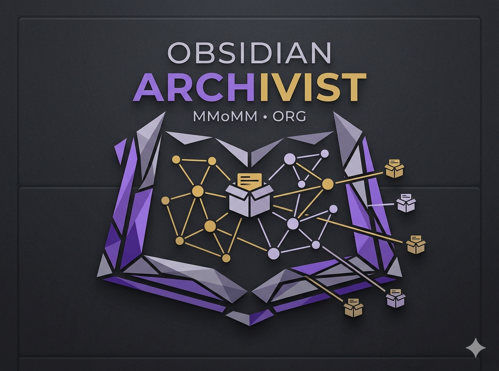
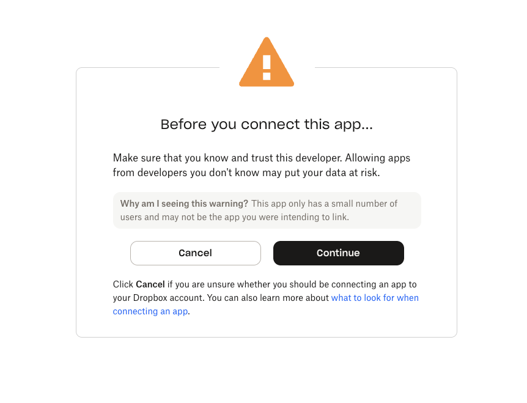

<p align="center">
  
</p>

# Archivist

Your vault's quiet historian. Versioned vault backups to Dropbox with content-addressed storage, hierarchical retention, and file-level restore.

**Status: pre-1.0.** Backup and restore are too important to call "done" prematurely. Archivist works well in my own daily use, but I want broader real-world use before stamping 1.0. Until then, please keep a second, independent backup of your vault (a periodic zip works fine).

## What it does

Archivist runs in the background, snapshots your Obsidian vault to Dropbox on a schedule you control, and lets you walk back through every version of every note. When something goes wrong — an accidental delete, a botched merge, a mystery overwrite — you find the version you wanted in the **Backup Browser** or the **Show history of current file** modal, click *Restore*, and the file comes back exactly as it was.

## Who it's for

- Obsidian users who already pay for Dropbox and want backups that are *theirs* (no third-party service holding your notes).
- Power users who want **per-file version history**, not just whole-vault snapshots.
- Anyone who's been bitten by syncing tools and wants a separate, audit-able backup channel.

## What's different about it

- **Content-addressed storage**: identical files dedupe automatically. Renaming a 50 MB attachment costs zero new bytes.
- **Hierarchical retention**: high-frequency snapshots in the last 24 h, daily for a month, monthly for years — without you tuning anything. A safety floor (`always_keep_n`, default 3) protects the most-recent snapshots even if you set the tier windows aggressively. Power-user commands *Preview retention (dry run)* and *Run retention now (delete)* let you inspect or force the prune flow on demand. For tier-by-tier details and tuning guidance, see [docs/operations/retention-guide.md](docs/operations/retention-guide.md).
- **Local-first**: your tokens and indexes live in the vault. The plugin opens exactly three network hosts (listed below) and never phones home elsewhere.
- **Standalone Restore CLI**: a zero-dependency Node script ships in every release. If the plugin or Obsidian ever goes south, you can still recover any file from your Dropbox folder using only `node`.

## A note of caution

**Backups are NOT stored as plain files on Dropbox** — Archivist uses content-addressed blobs and per-snapshot manifests, not a 1:1 mirror of your vault. So you can't just open Dropbox in your browser and grab a file out of it. Recovery happens through the in-app **Backup Browser** / **Show history of current file**, or — if the plugin or Obsidian themselves break — through the bundled [standalone CLI](docs/restore-guide.md) which works on your local Dropbox-synced folder with zero plugin dependencies.

I use this plugin personally on my own vault with roughly 6000+ files and I'm not planning to break it. But: **never trust a backup you haven't restored**. Try a restore once in a while — the *Restore to new location* button is non-destructive (it adds a timestamp suffix), so you can compare against the live file before deciding what to keep.

For a deeper look at how the storage layout works (and why it's not just files in folders), see [docs/architecture-overview.md](docs/architecture-overview.md).

## Screenshots

**Backup Browser** — three-column layout: snapshots (grouped by Today / Yesterday / This week / This month / Older), files at the selected snapshot, and a Markdown preview with Restore controls.


**File Versions** — invoke *Show history of current file* from the command palette on any note. Rename markers, preview, and one-click restore.


**Settings — Schedule** (designated-device toggle, full + incremental cadence, active window).


**Settings — Retention** (3-tier hierarchical retention + storage cap).


**Settings — Dropbox** (OAuth connect, account info, vault folder).


<details>
<summary>More settings panels (Notifications, Advanced)</summary>


</details>

## Setup

1. **Install** Archivist (see *Installation* below).
2. **Open Settings → Archivist → Schedule** and toggle *This device backs up the vault* on. Pick the device that will perform backups (only one device per vault should be designated; multiple-device safety is built in but the simplest setup is one designated device).
3. **Open Settings → Archivist → Advanced** and set **Vault folder name** — this is the folder name under `Apps/Archivist/` where this vault's backups will live (lets you back up several vaults into separate folders). Default: a slug of the Obsidian vault name. **Note:** if you change this after the plugin already loaded, disable + re-enable Archivist (or restart Obsidian) so all services pick up the new path.
4. **Open Settings → Archivist → Dropbox** and click *Connect Dropbox*. The browser opens, you log in, you authorize the app, and you're returned to Obsidian.

   > **You will see a Dropbox warning that this app is "not yet verified by Dropbox"** — this is expected. Dropbox marks every new third-party integration this way until it has accumulated enough usage to be auto-promoted. Archivist is open source ([source on GitHub](https://github.com/MMoMM-org/obsidian-archivist)) and only requests the four scopes documented under [Dropbox scopes](#dropbox-scopes) below; you can audit exactly what is requested before clicking *Allow*. The warning will go away on its own as the user base grows.
   >
   > 

5. The first **full backup** will run after a 10-minute startup grace + a 2-minute quiet period (configurable). After that, **incrementals** run every 15 minutes when there are changes; **fulls** run weekly by default.

## Dropbox scopes

Archivist requests these Dropbox scopes during OAuth. They are the *minimum* needed for the plugin to function, in line with Dropbox's principle-of-least-privilege guidance.

| Scope | Why we need it |
|-------|----------------|
| `files.content.write` | Upload backup blobs and manifests to the plugin's app folder. |
| `files.content.read` | Download blobs for restore + manifest fetch for history. |
| `files.metadata.read` | List the contents of the app folder (for orphan-blob detection during garbage collection). |
| `account_info.read` | Display the connected account's email in Settings (so you can confirm which account you're connected to). |

The plugin uses the **App Folder** permission model — it can ONLY read or write files inside `Apps/Archivist/<vault-prefix>/` in your Dropbox. It never sees the rest of your Dropbox. This is enforced by Dropbox's OAuth scope, not just by our code.

## Network hosts

Archivist opens connections to these hosts and **only** these hosts. They are declared in `manifest.json` for community-plugin review.

| Host | Purpose |
|------|---------|
| `api.dropboxapi.com` | OAuth token exchange + JSON metadata API. |
| `content.dropboxapi.com` | Binary upload + download. |
| `www.dropbox.com` | OAuth authorization endpoint (browser redirect). |

If you see Archivist contacting any other host, that's a bug — please file it.

## How tokens are stored (read this)

Archivist stores your Dropbox **access token** and **refresh token** in Obsidian's encrypted secret store (`app.secretStorage`, introduced in Obsidian 1.11.4 and backed by Electron's `safeStorage`). They are kept under the id `archivist-dropbox-tokens` as a single JSON-encoded blob. They are **not** written to `data.json`, **not** written to disk as plaintext, and **not** synced by Obsidian Sync.

**Where the encryption keys live** (varies by OS):

| OS | Master key location | At-rest encryption |
|---|---|---|
| **macOS** | Login Keychain, entry **"Obsidian Safe Storage"** (`application password`) | Real — AES via the keychain-resident key. The encrypted blob lives in `~/Library/Application Support/obsidian/`; a casual read of it yields ciphertext. |
| **Windows** | User-scoped DPAPI | Real — tied to your Windows user account. A different account on the same machine cannot decrypt. |
| **Linux** | libsecret / GNOME Keyring / KWallet | Real **if** a secret service is available. **If it isn't, Electron falls back to basic obfuscation — not real encryption.** Linux users without a configured keyring should rely on full-disk encryption instead. |

**Best practices**:

- **Don't share `data.json` or your vault's `.obsidian/` folder** with anyone — even though tokens aren't in there anymore, your settings, vault id, and per-device backup state still are.
- **In-Obsidian threat model**: any other plugin running in the same Obsidian instance can read your token by calling `app.secretStorage.getSecret('archivist-dropbox-tokens')`. Obsidian does not isolate secrets per plugin. Only install plugins you trust.
- **Multi-device sync**: Tokens are per-machine — each device authenticates separately, by design. Obsidian Sync replicates only `data.json` (settings + vault id), which is intentional. Other vault-syncing tools (iCloud, Syncthing, Dropbox Desktop) will replicate `.obsidian/plugins/obsidian-archivist/` files (the local backup index, the pending-changes queue) but **not** your tokens, since those live in your OS keychain.
- **If you suspect a token leak**, click *Disconnect Dropbox* in Settings (this revokes the token server-side) and reconnect. You can also revoke from <https://www.dropbox.com/account/connected_apps>.
- **If you sync the `Apps/Archivist/` folder locally** (e.g. via the Dropbox Desktop app's selective-sync) consider excluding it if disk space is tight — the backup data has nothing useful for live work, only for the standalone CLI's break-glass recovery.

**Upgrading from earlier versions**: 0.7.x and earlier stored tokens in `<vault>/.obsidian/plugins/obsidian-archivist/tokens.json` (plaintext + `chmod 0o600` on desktop). On your first start with 0.8.0 Archivist reads that file once, writes its contents into the encrypted secret store, and deletes it. No re-authentication is required. If you want to confirm the legacy file is gone, check the plugin's folder after restarting.

## Already using Aut-O-Backups?

There's another Obsidian community plugin that also backs up to Dropbox: [Aut-O-Backups](https://github.com/ryanpcmcquen/obsidian-dropbox-backups) by ryanpcmcquen (plugin id `obsidian-dropbox-backups`). The two are independent — they're separate Dropbox apps, talking to separate folders, with no shared state. So **running both isn't dangerous**, but it backs up the same vault twice and burns double the CPU + bandwidth for no benefit. Archivist will show a one-time advisory if it detects Aut-O-Backups enabled, suggesting you pick one.

If you decide to switch from Aut-O-Backups to Archivist:

1. **Disable Aut-O-Backups** in Settings → Community plugins.
2. **Set up Archivist** (see *Setup* above).
3. Once you've verified Archivist is backing up reliably, **uninstall Aut-O-Backups** and **delete its old backup folder on Dropbox** (it's not migrated — the storage layouts are incompatible).

### Differences worth knowing about

| | Aut-O-Backups | Archivist |
|---|---|---|
| **Storage layout** | One copy of every vault file written into Dropbox at every backup | Content-addressed blobs (SHA-256) + per-snapshot manifests |
| **Deduplication** | None — every backup uploads everything again | Identical files uploaded once across all snapshots |
| **Renames** | Treated as new file (re-upload at the new path) | Tracked as a manifest entry, no new bytes |
| **Retention** | Manual (you delete old backups yourself) | Hierarchical 3-tier (never-prune window + daily + monthly) with garbage collection |
| **Per-file restore** | Manual: copy a file out of the latest backup folder | Backup Browser tab + *Show history of current file* command |
| **Recovery without the plugin** | Files are plain copies on Dropbox — open the folder | Standalone Node CLI (`scripts/restore.mjs`) reconstructs any snapshot from a local Dropbox-mirrored folder. See [docs/restore-guide.md](docs/restore-guide.md) |
| **Storage growth** | Grows linearly with backup count × vault size | Grows with unique-content additions, capped by retention |
| **Failure mode if left unattended** | Storage fills the Dropbox account | 3-tier retention prunes old data automatically; backups pause if a hard storage cap is reached |

Whichever plugin you pick, **never trust a backup you haven't restored** — try a recovery on both before deciding.

## Troubleshooting

For corruption-recovery scenarios (broken chain, repair commands, GC lock cleanup, what to capture for a bug report), see [docs/troubleshooting/dropbox-corruption.md](docs/troubleshooting/dropbox-corruption.md). For the "I'm pointing this vault at an existing Dropbox folder" / vault-id adoption flow, see [docs/operations/connecting-existing-backup.md](docs/operations/connecting-existing-backup.md). The common cases below cover the rest.

**"Dropbox disconnected" / Archivist lost access to your account**

This usually means the refresh token was revoked (manually or by inactivity). Open Settings → Archivist → Dropbox and click *Connect Dropbox* again. Your existing backups in Dropbox are NOT affected by re-authenticating.

**"Backups paused — storage cap reached"**

Archivist defaults to a 200 GB hard limit. Either raise the cap (Settings → Retention → *Hard storage limit*) or reduce retention windows (shorter daily/monthly windows). Existing snapshots are not deleted automatically when the cap is reached — backups simply pause until you adjust.

**"Two devices are designated as the backup owner"**

You have two devices both flagged as the designated backup device. Pick one in Settings → Archivist → Schedule → *This device backs up the vault* and toggle the other off. Archivist won't lose data — both devices can read from the same Dropbox folder; only one should write at a time.

**Backups feel slow / are using too much CPU**

Tune Settings → Advanced → *Concurrent uploads* (default 4, range 1–8) and *Upload chunk size* (default 8 MB, range 4–64). Lower values reduce CPU and memory; higher values speed up large file uploads.

**Where do I find logs?**

Archivist logs to Obsidian's developer console. To open it: **Cmd/Ctrl + Shift + I** → **Console** tab. Filter for `[archivist]` to drop unrelated Obsidian noise. Default-mode logs are minimal and contain no path data. For a bug report: toggle Settings → Advanced → *Diagnostic logging* on, reproduce the issue, copy the console output, then turn it back off. The full bug-report capture flow is in [docs/troubleshooting/dropbox-corruption.md](docs/troubleshooting/dropbox-corruption.md#what-to-capture-for-a-bug-report).

## Standalone Restore CLI

Every release ships a zero-dependency Node script — `scripts/restore.mjs` — that can reconstruct any snapshot from your **local** Dropbox-synced folder. No Obsidian, no plugin, no internet, no `npm install`. Just `node` 18+ and the bytes on your disk.

This is your **break-glass recovery tool**. The full walkthrough — where to get the script, `--at` selectors, dry-run / verify modes, current limitations — is in **[docs/restore-guide.md](docs/restore-guide.md)**.

## Installation

### Community Plugins (recommended)
1. Open Obsidian Settings → Community Plugins
2. Click **Browse**, search for **Archivist**
3. Click **Install**, then **Enable**

### Manual
For air-gapped installs or pinning to a specific version.

1. Download `main.js`, `manifest.json`, `styles.css`, and `restore.mjs` from the [latest release](https://github.com/MMoMM-org/obsidian-archivist/releases/latest)
2. Create folder `<vault>/.obsidian/plugins/archivist/`
3. Copy `main.js`, `manifest.json`, and `styles.css` into that folder
4. Keep `restore.mjs` somewhere safe — it's your break-glass recovery tool
5. Restart Obsidian and enable the plugin

### BRAT (unreleased main builds)
For testing changes ahead of the next official release — useful if you're chasing a fix that has merged to `main` but hasn't been tagged yet. Not recommended for everyday use; the Community Plugins channel covers that.

1. Install [BRAT](https://github.com/TfTHacker/obsidian42-brat)
2. Add beta plugin: `MMoMM-org/obsidian-archivist`

**Already running via BRAT?** You can switch to the official channel without losing settings, backup history, or Dropbox connection: disable Archivist in Obsidian, remove it from BRAT's Beta Plugin List (decline if BRAT offers to delete the plugin files — your `data.json`, `index.json`, etc. live there), then install Archivist from Community Plugins. The plugin ID is identical in both channels, so all local data and SecretStorage tokens survive the switch.

## Release notes

Per-version changes are tracked in [CHANGELOG.md](CHANGELOG.md). The latest release is also pinned at the top of the [GitHub Releases page](https://github.com/MMoMM-org/obsidian-archivist/releases).

## Issue tracker / contact

Bug reports + feature requests: <https://github.com/MMoMM-org/obsidian-archivist/issues>

When filing a bug, please include:

1. Obsidian version (Settings → About).
2. Archivist version (`manifest.json` in the plugin folder).
3. Operating system + version.
4. A reproduction recipe if possible.
5. **Don't paste your `data.json`** — it contains your vault id and settings. (Your Dropbox tokens are in Obsidian's encrypted secret store, not in any file in the plugin folder; on 0.7.x installs that haven't restarted under 0.8.0 yet, also avoid pasting any `tokens.json` that may still be present.)

Security issues: please email the maintainer (see `package.json` author field) instead of filing a public issue.

## Development

```bash
git clone https://github.com/MMoMM-org/obsidian-archivist.git
cd obsidian-archivist
git config core.hooksPath .githooks
npm install
npm run dev       # Watch mode
npm run build     # Production build
npm test          # Run tests
npm run lint      # Lint
npm run typecheck # TypeScript only
npm audit         # Dependency audit
```

## License

MIT — see [LICENSE](LICENSE).
