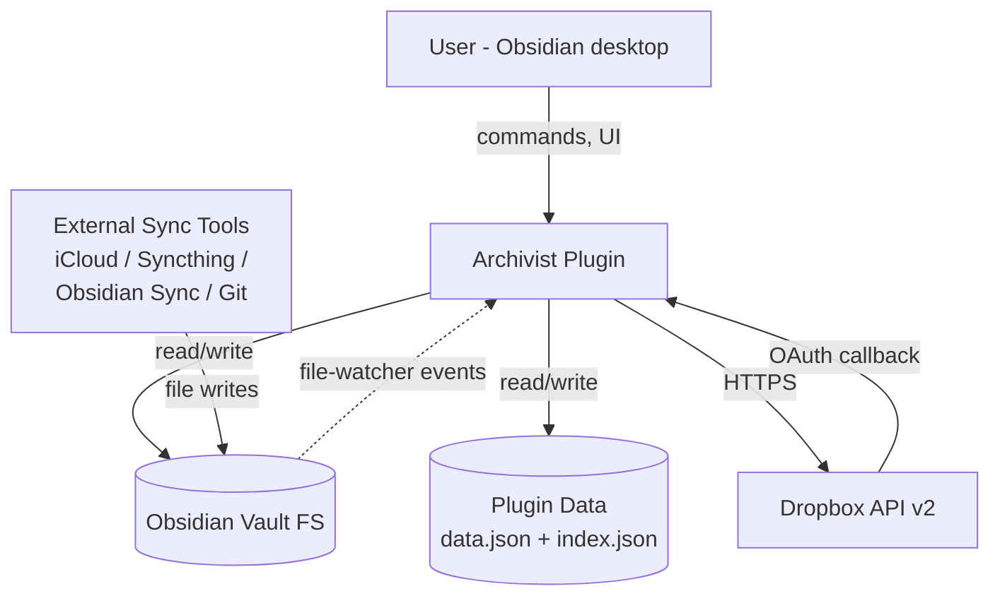
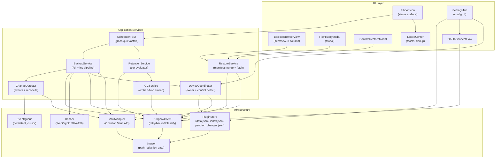
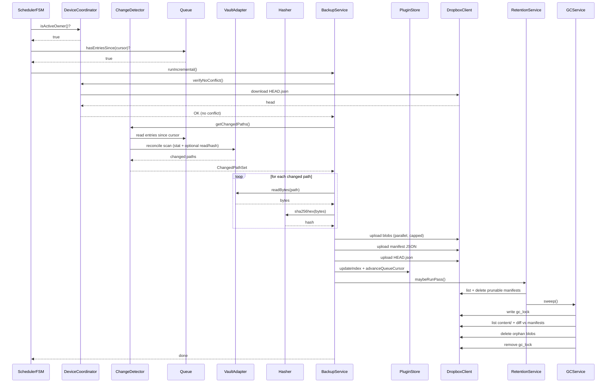
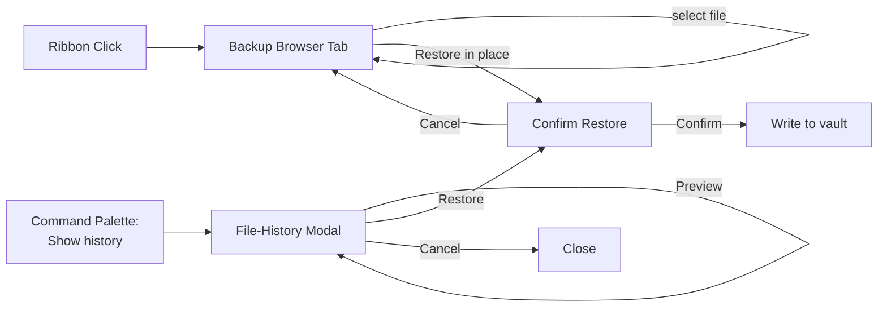
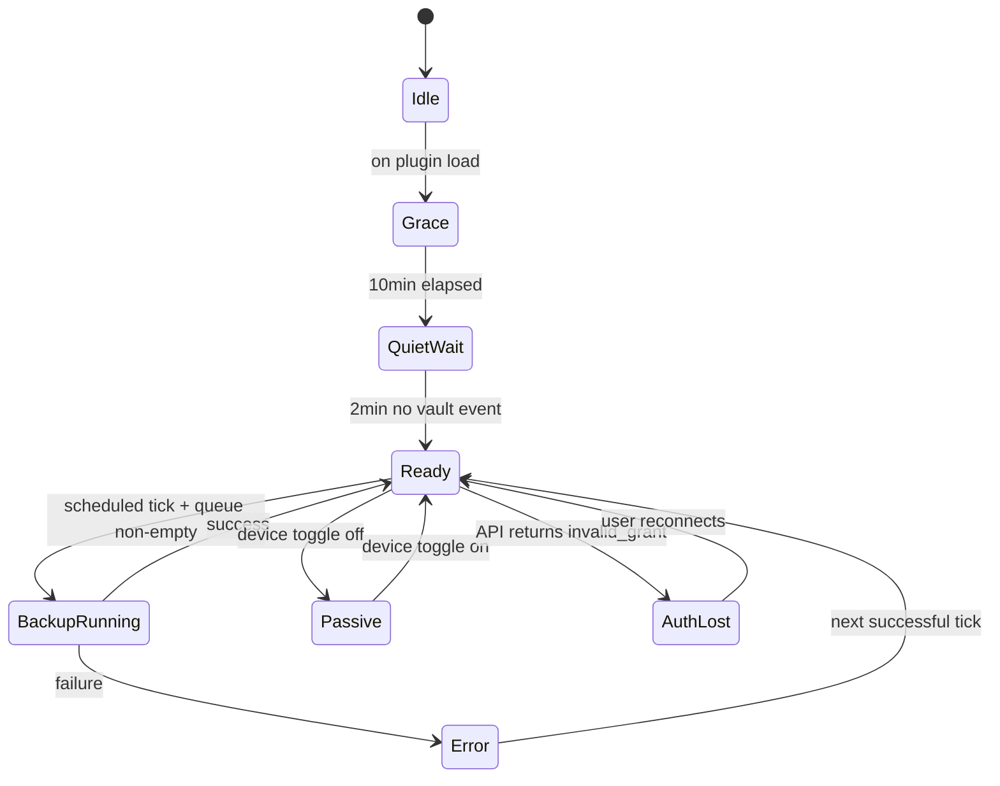

# Solution Design Document

## Validation Checklist

### CRITICAL GATES (Must Pass)

- [x] All required sections are complete
- [x] No [NEEDS CLARIFICATION] markers remain
- [x] Architecture pattern is clearly stated with rationale
- [x] All architecture decisions confirmed (auto mode — flagged for post-hoc review)
- [x] Every interface has specification

### QUALITY CHECKS (Should Pass)

- [x] All context sources are listed with relevance ratings
- [x] Project commands are discovered from actual project files
- [x] Constraints → Strategy → Design → Implementation path is logical
- [x] Every component in diagram has directory mapping
- [x] Error handling covers all error types
- [x] Quality requirements are specific and measurable
- [x] Component names consistent across diagrams
- [x] A developer could implement from this design
- [x] Implementation examples use concrete shapes (TypeScript interfaces, not pseudocode)
- [x] Complex algorithms (manifest merge, retention pass, GC) include traced walkthroughs

---

## Constraints

CON-1 **Obsidian plugin runtime.** Plugin runs inside Obsidian's Electron shell on desktop (`isDesktopOnly: true` — mobile deferred post-V1 per ADR-12). `minAppVersion: 1.5`. No `eval`, no `innerHTML` on user content, declared network domains only. Must cleanly unregister all listeners/intervals on `onunload`.

CON-2 **TypeScript strict + esbuild.** `strict: true`, `strictNullChecks: true`. Built with esbuild (Obsidian-standard, replaces rollup). Single bundled `main.js` ships to users.

CON-3 **Crypto.** Use Web Crypto API (`crypto.subtle.digest`) for SHA-256. Uniform across all hot paths; no Node-crypto variants to maintain. (Originally motivated by mobile parity — mobile is deferred per ADR-12 but WebCrypto remains the cleaner choice and preserves the post-V1 mobile re-add path with zero migration.)

CON-4 **Dropbox API scope model.** Restore requires `files.content.read`; upload requires `files.content.write`; listing requires `files.metadata.read`. No narrower scope supports file-level restore. App Folder mode (`Apps/Archivist/*`) provides blast-radius containment at the Dropbox-app level.

CON-5 **Single-maintainer budget.** 8–12 weeks part-time to V1. Scope aggressively bounded (see PRD Won't-Have).

CON-6 **Privacy-first defaults.** No telemetry in V1. No content in logs. Paths in logs only when diagnostic mode is toggled on (off by default).

CON-7 **Obsidian Community Plugin review compliance.** Bundled `main.js` will be scanned for `eval(`, `innerHTML` with user content, undeclared network hosts, hard-coded secrets, `minAppVersion` mismatches.

CON-8 **Reference-vault calibration.** Design validated for ≤ 20k files, ≤ 5 GB vault, ≤ 50 edits/day/device. Performance beyond that is best-effort.

CON-9 **Dedup vs encryption.** Content-addressed dedup and client-side encryption are architecturally incompatible in naive form. V1 chooses dedup; encryption deferred to V2.

## Implementation Context

**IMPORTANT**: This section lists what a developer must read before writing code. The repo is a fresh scaffold — primary context is the PRD, the source brainstorm, and external Obsidian/Dropbox docs.

### Required Context Sources

#### Documentation Context

```yaml
# Internal documentation and patterns
- doc: docs/XDD/specs/001-archivist-plugin/requirements.md
  relevance: CRITICAL
  why: "PRD — every feature, acceptance criterion, persona, and user journey traces back here."

- doc: 2026-04-23-archivist-plugin.md
  relevance: HIGH
  why: "Original brainstorm; source of record for design rationale, retention math, and rejected alternatives."

- doc: CLAUDE.md
  relevance: MEDIUM
  why: "Repo conventions: feature branch per change, commit after every task, block-main-edits hook, build commands."

# External documentation and APIs
- url: https://docs.obsidian.md/Plugins/Vault
  relevance: CRITICAL
  why: "Vault events (create/modify/delete/rename), TFile contract, TFile.stat semantics."

- url: https://docs.obsidian.md/Reference/TypeScript+API/Plugin
  relevance: CRITICAL
  why: "Plugin lifecycle — onload, onunload, registerEvent, registerInterval, registerDomEvent."

- url: https://docs.obsidian.md/Reference/TypeScript+API/MarkdownRenderer
  relevance: HIGH
  why: "Safe rendering of user markdown in Backup Browser preview pane (avoids innerHTML XSS)."

- url: https://docs.obsidian.md/Reference/TypeScript+API/ItemView
  relevance: HIGH
  why: "Base class for Backup Browser tab view."

- url: https://docs.obsidian.md/Reference/TypeScript+API/Modal
  relevance: HIGH
  why: "Base class for File-History modal and restore confirmations; focus management."

- url: https://docs.obsidian.md/Plugins/Releasing/Submission+requirements+for+plugins
  relevance: CRITICAL
  why: "Community plugin review checklist — known rejection reasons."

- url: https://www.dropbox.com/developers/documentation/http/documentation
  relevance: CRITICAL
  why: "Dropbox HTTP API v2 — endpoint contracts, error shapes, rate-limit behavior."

- url: https://www.dropbox.com/developers/reference/oauth-guide
  relevance: CRITICAL
  why: "PKCE OAuth flow, scope model, App Folder mode, token lifecycle."

- url: https://github.com/dropbox/dropbox-sdk-js
  relevance: HIGH
  why: "`dropbox` npm SDK — current version, types, error classes, auto-refresh behavior."
```

#### Code Context

```yaml
- file: package.json (NEW)
  relevance: CRITICAL
  why: "Dependency pins, build scripts, test runner. Will be authored as part of Plan Phase 1."

- file: manifest.json (NEW)
  relevance: CRITICAL
  why: "Obsidian plugin manifest — id, minAppVersion, isDesktopOnly, author, description. Required for community submission."

- file: versions.json (NEW)
  relevance: HIGH
  why: "Obsidian plugin version-to-minAppVersion map."

- file: esbuild.config.mjs (NEW)
  relevance: HIGH
  why: "Build pipeline. Must drop console statements in production."

- file: tsconfig.json (NEW)
  relevance: HIGH
  why: "strict: true, strictNullChecks: true, target ES2020+."

- file: .eslintrc.json (NEW)
  relevance: MEDIUM
  why: "Community rule: eslint-plugin-obsidianmd; custom rule banning innerHTML with non-literal RHS."

- file: vitest.config.ts (NEW)
  relevance: MEDIUM
  why: "Unit + integration test runner; needs vault-adapter and dropbox-client mocks."
```

#### External APIs

```yaml
- service: Dropbox HTTP API v2
  doc: https://www.dropbox.com/developers/documentation/http/documentation
  relevance: CRITICAL
  why: "Content upload/download, metadata listing, delete, chunked upload sessions, auth."

- service: Obsidian Plugin API
  doc: https://docs.obsidian.md/Home
  relevance: CRITICAL
  why: "Vault events, file reads, workspace surfaces (ItemView, Modal, Notice, Setting)."
```

### Implementation Boundaries

- **Must Preserve:**
  - Obsidian plugin lifecycle contract (every listener registered via `this.registerX`, clean unload).
  - Dropbox App Folder scope — the plugin MUST NOT call any endpoint that operates outside `Apps/Archivist/`.
  - Vault file integrity — the live vault is never modified except during an explicit, user-confirmed restore.
- **Can Modify:**
  - Any file inside this repository.
  - Plugin data folder (`<vault>/.obsidian/plugins/obsidian-archivist/`).
  - The `Apps/Archivist/<VAULT_PREFIX>/` folder in the user's Dropbox (only after OAuth grant).
- **Must Not Touch:**
  - Any Dropbox path outside the App Folder — prevented by scope, but also enforced in code (asserted path prefix in every API call).
  - Any vault file during a reconcile scan — reconcile reads only.
  - `data.json` of other plugins.

### External Interfaces

#### System Context Diagram



#### Interface Specifications

```yaml
inbound:
  - name: "User Commands / UI Actions"
    type: in-process
    format: Obsidian Command Palette / Ribbon click / Settings UI / ItemView / Modal
    authentication: N/A (local user)
    data_flow: "User triggers: Open Backup Browser, Show File History, Back Up Now, Connect Dropbox, Disconnect, toggle designated device, change retention settings."

  - name: "Vault Events"
    type: in-process
    format: Obsidian Vault API events (create | modify | delete | rename)
    authentication: N/A
    data_flow: "Obsidian informs the plugin of vault changes. Events enqueue into the pending-changes queue."

  - name: "Dropbox OAuth Callback"
    type: HTTP redirect (to a custom Obsidian URI scheme `obsidian://`)
    format: URL with `code` and `state` query parameters
    authentication: state-parameter CSRF prevention
    data_flow: "Dropbox redirects user's browser back to Obsidian with an authorization code to exchange for tokens."

outbound:
  - name: "Dropbox API v2 (Metadata)"
    type: HTTPS
    format: JSON-RPC over HTTP
    authentication: OAuth 2.0 Bearer (short-lived access token auto-refreshed)
    doc: https://www.dropbox.com/developers/documentation/http/documentation
    data_flow: "files/list_folder, files/list_folder/continue, files/get_metadata — enumerate content/ and snapshots/."
    criticality: CRITICAL

  - name: "Dropbox API v2 (Content)"
    type: HTTPS
    format: HTTP with binary body
    authentication: OAuth 2.0 Bearer
    doc: https://www.dropbox.com/developers/documentation/http/documentation
    data_flow: "files/upload, files/upload_session/{start|append_v2|finish}, files/download, files/delete_v2."
    criticality: CRITICAL

  - name: "Dropbox OAuth"
    type: HTTPS + browser redirect
    format: PKCE authorization code flow
    authentication: PKCE code_verifier / code_challenge
    doc: https://www.dropbox.com/developers/reference/oauth-guide
    data_flow: "POST /oauth2/token for code exchange and refresh; POST /oauth2/token/revoke on disconnect."
    criticality: CRITICAL

data:
  - name: "Obsidian Plugin Data Folder"
    type: Filesystem via Obsidian DataAdapter
    connection: `this.app.vault.adapter` (FileSystemAdapter — desktop only in V1)
    data_flow: "Persistent state: data.json (tokens + settings), index.json (path→hash snapshot), pending_changes.json (event queue), device.json (device_id + designated flag)."

  - name: "Dropbox App Folder"
    type: HTTPS via Dropbox SDK
    connection: `Dropbox` SDK client instance (singleton per plugin load)
    data_flow: "Remote-of-record: content/ blobs + snapshots/ manifests + HEAD pointer + gc_lock marker."
```

### Cross-Component Boundaries

Archivist is a single-component plugin. No inter-process boundaries beyond the Obsidian ↔ Dropbox API seam documented above.

- **API Contracts**: The Dropbox App-Folder file layout (`content/<hash-prefix>/<hash>`, `snapshots/<iso-timestamp>-<type>.json`, `HEAD.json`, `gc_lock`) is the durable contract. Schema changes require a `schema_version` bump in every manifest; old manifests are read-only-compatible going forward.
- **Team Ownership**: Single maintainer (Marcus). No team coordination.
- **Shared Resources**: None beyond the Dropbox account, which is user-owned.
- **Breaking Change Policy**: Manifest schema is versioned (`schema_version: "1.0"`). Any breaking change to manifest fields requires a new schema_version, a read-compatibility path for older versions, and a clear user-facing note in release notes.

### Project Commands

```bash
# Discovered from CLAUDE.md (docs only; package.json will be authored in Plan Phase 1).
Install: npm install
Dev:     npm run dev         # esbuild watch
Test:    npm test            # vitest unit
Lint:    npm run lint        # eslint with obsidianmd rules
Build:   npm run build       # tsc --noEmit + esbuild production
Test watch:     npm run test:watch
Coverage:       npm run test:coverage
```

## Solution Strategy

- **Architecture Pattern:** **Modular layered** with a **reactive event pipeline**. Layers: UI (Obsidian views/modals/settings) → Application Services (backup, restore, retention, GC, device-coordination) → Infrastructure (Dropbox client, crypto, file-io, queue, state-machines).
- **Integration Approach:** In-process Obsidian plugin. All external calls go through a single `DropboxClient` wrapper (retry/backoff/error-classification centralized). All vault reads go through `VaultAdapter` (thin wrapper over Obsidian Vault API for mockability).
- **Justification:** Obsidian plugins are single-process, single-language. Layering is the minimum viable structure to keep the reactive pipeline (events → queue → scheduler → backup) testable in isolation from Obsidian. No microservices, no event bus, no RPC — the plugin is one JavaScript module.
- **Key Decisions:**
  - **Content-addressed storage (CAS)** for server layout — automatic dedup, content-integrity via hash, clean GC boundary.
  - **Hybrid change detection** — events (fast) + reconcile (correct) — correctness wins when they disagree.
  - **Commit protocol: blobs → manifest → HEAD** — crash-safe; orphan blobs tolerated, orphan manifests fatal.
  - **Designated-device** ownership with startup conflict-detection — simplest model that rules out two-device races for V1.
  - **Rename is first-class** in the manifest schema — preserves File History continuity across renames (primary use case).
  - **Token storage in dedicated `tokens.json` (outside `data.json`) with disclosure** — keeps tokens off the Obsidian-Sync path (ADR-7, consistent with ADR-11 for `index.json`); `electron.safeStorage` migration path reserved for V2.
  - **MarkdownRenderer-only preview** — eliminates the XSS/Electron-RCE risk class.

## Building Block View

### Components



### Directory Map

**Component**: archivist-plugin (single component, all code lives here)

```
.
├── manifest.json                           # NEW: Obsidian plugin manifest
├── versions.json                           # NEW: version→minAppVersion map
├── package.json                            # NEW: deps + scripts
├── tsconfig.json                           # NEW: strict TS config
├── esbuild.config.mjs                      # NEW: build pipeline
├── .eslintrc.json                          # NEW: eslint-plugin-obsidianmd + custom rules
├── vitest.config.ts                        # NEW: test config
├── styles.css                              # NEW: plugin styles (CSS vars only)
├── src/
│   ├── main.ts                             # NEW: Plugin entry (onload/onunload)
│   ├── ui/
│   │   ├── RibbonIcon.ts                   # NEW: ribbon + tooltip state machine
│   │   ├── SettingsTab.ts                  # NEW: PluginSettingTab
│   │   ├── BackupBrowserView.ts            # NEW: ItemView, 3-column layout
│   │   ├── FileHistoryModal.ts             # NEW: Modal with version list
│   │   ├── ConfirmRestoreModal.ts          # NEW: confirmation dialog
│   │   ├── OAuthConnectFlow.ts             # NEW: PKCE state + UI handoff
│   │   ├── NoticeCenter.ts                 # NEW: toast dedup + routing
│   │   └── strings.ts                      # NEW: all user-visible strings (i18n ready)
│   ├── services/
│   │   ├── SchedulerFSM.ts                 # NEW: grace/quiet/active/backup state
│   │   ├── MaintenanceScheduler.ts         # NEW: async retention/GC runner (decoupled from backup hot path — ROB-002)
│   │   ├── BackupService.ts                # NEW: full + inc pipeline orchestrator
│   │   ├── ManifestBuilder.ts              # NEW: pure snapshot manifest builder (ROB-015 — was missing from map)
│   │   ├── RestoreService.ts               # NEW: manifest merge + content fetch + write + per-path mutex (ROB-010)
│   │   ├── SnapshotIndexStore.ts           # NEW: ADR-20 — lightweight metadata cache over Dropbox
│   │   ├── RetentionService.ts             # NEW: tier evaluator + transitive chain-integrity
│   │   ├── GCService.ts                    # NEW: orphan-blob sweep with lock marker
│   │   ├── DeviceCoordinator.ts            # NEW: designated-device + conflict detection + double-check (ROB-001)
│   │   └── ChangeDetector.ts               # NEW: events + reconcile scan
│   ├── infra/
│   │   ├── DropboxClient.ts                # NEW: SDK wrapper, retry, error classification
│   │   ├── VaultAdapter.ts                 # NEW: Obsidian Vault API wrapper
│   │   ├── PluginStore.ts                  # NEW: data.json / index.json / queue persistence
│   │   ├── Hasher.ts                       # NEW: WebCrypto SHA-256 hex
│   │   ├── EventQueue.ts                   # NEW: append-only + committed_through cursor
│   │   └── Logger.ts                       # NEW: gated logger (path-redaction policy)
│   ├── model/
│   │   ├── Manifest.ts                     # NEW: SnapshotManifest type + guards
│   │   ├── Index.ts                        # NEW: LocalIndex type + guards
│   │   ├── SnapshotIndex.ts                # NEW: SnapshotIndex + SnapshotIndexEntry types (ADR-20)
│   │   ├── QueueEntry.ts                   # NEW: ChangeEvent shape
│   │   ├── Settings.ts                     # NEW: PluginSettings shape + SETTINGS_MIGRATIONS registry (ROB-006)
│   │   ├── StartupState.ts                 # NEW: unified startup-state enum (ROB-008)
│   │   └── Errors.ts                       # NEW: ArchivistError hierarchy (split per ROB-005)
│   └── util/
│       ├── paths.ts                        # NEW: Dropbox path builders + prefix guards
│       ├── time.ts                         # NEW: ISO-8601 helpers, schedule math
│       ├── glob.ts                         # NEW: exclusion-glob matcher
│       └── retry.ts                        # NEW: exponential backoff helper
├── tests/
│   ├── unit/                               # NEW: *.test.ts co-located with services
│   ├── integration/                        # NEW: mocked DropboxClient, in-memory VaultAdapter
│   ├── cli/                                # NEW: standalone CLI tests (Node subprocess)
│   └── fixtures/                           # NEW: synthetic vault trees, manifest fixtures
├── scripts/
│   └── restore.mjs                         # NEW: standalone restore CLI — ADR-19, zero deps
└── docs/
    ├── XDD/specs/001-archivist-plugin/     # EXISTS: this spec
    └── ai/memory/                           # EXISTS: per CLAUDE.md
```

### Interface Specifications

#### Interface Documentation References

```yaml
interfaces:
  - name: "Dropbox HTTP API v2"
    doc: https://www.dropbox.com/developers/documentation/http/documentation
    relevance: CRITICAL
    sections: [files.upload, files.upload_session.*, files.download, files.list_folder, files.list_folder.continue, files.delete_v2, oauth2.token, oauth2.token.revoke]
    why: "All remote operations; error shapes; retry semantics."

  - name: "Obsidian Vault API"
    doc: https://docs.obsidian.md/Plugins/Vault
    relevance: CRITICAL
    sections: [Events (create/modify/delete/rename), TFile.stat, getFiles, adapter.read/write, onLayoutReady]
    why: "All local vault reads + change detection."

  - name: "Obsidian Plugin Lifecycle"
    doc: https://docs.obsidian.md/Reference/TypeScript+API/Plugin
    relevance: CRITICAL
    sections: [onload, onunload, registerEvent, registerInterval, loadData, saveData]
    why: "Plugin-state hygiene; prevents listener leaks after disable."
```

#### Data Storage Changes

No database. Two classes of persistent storage:

**Local (plugin-data folder):**

```yaml
# Path: <vault>/.obsidian/plugins/obsidian-archivist/
data.json:           # saveData()/loadData() - Obsidian-managed; IS synced by Obsidian Sync if user has it (intentional for settings + device state)
  schema_version: "1.0"
  settings: PluginSettings       # see model/Settings.ts — retention tiers, schedule, toggles
  device:
    device_id: UUIDv4              # generated once per install — per-device identity (sync'd is fine; describes the device)
    designated: boolean            # "this device performs backups"
    device_label: string           # user-editable hostname (display)
  ui:
    predecessor_notice_dismissed: boolean (default false)

tokens.json:         # written via adapter.write, OUTSIDE data.json — NOT Obsidian-Synced (per ADR-7)
  schema_version: "1.0"
  access_token: string (nullable)          # PLAINTEXT — disclosed in README
  refresh_token: string (nullable)         # PLAINTEXT — disclosed in README
  access_token_expires_at: ISO-8601 (nullable)
  dropbox_account_email: string (nullable) # display-only

index.json:          # written via adapter.write, OUTSIDE data.json — NOT Obsidian-Synced
  schema_version: "1.0"
  last_full_snapshot_id: string (nullable)
  last_inc_snapshot_id: string (nullable)
  last_full_commit_at: ISO-8601 (nullable)
  last_inc_commit_at: ISO-8601 (nullable)
  files: { [vault_path: string]: { hash: string (sha256hex), size: number, mtime: number } }

pending_changes.json:  # persistent event queue
  schema_version: "1.0"
  committed_through: ISO-8601 (nullable)   # cursor — entries older are already in a committed snapshot
  entries:
    - id: UUIDv4
      type: "create" | "modify" | "delete" | "rename"
      path: string
      prev_path: string (nullable, rename only)
      observed_at: ISO-8601

device.json: merged into data.json.device (no separate file)
auth: split OUT of data.json into tokens.json (ADR-7)
```

**Remote (Dropbox `Apps/Archivist/<VAULT_PREFIX>/`):**

```yaml
HEAD.json:
  schema_version: "1.0"
  snapshot_id: string                # filename base of latest snapshot
  snapshot_type: "full" | "inc"
  device_id: string                  # device_id of writer — used for conflict detection
  committed_at: ISO-8601

snapshot_index.json:                 # LIGHTWEIGHT METADATA CACHE (ADR-20) — enables metadata-only retention + fast restore
  schema_version: "1.0"
  last_updated_at: ISO-8601
  snapshots:                         # array, not keyed — preserves natural commit order
    - id: string                     # mirrors snapshots/<id>.json filename base
      type: "full" | "inc"
      parent_id: string (nullable)
      created_at: ISO-8601
      device_id: string              # writer device — avoids a second download for audit
      blob_hashes: string[]          # every content-hash referenced by this snapshot's files (union of files[].hash)
      # NB: vault paths + file sizes + mtimes are NOT mirrored here — that would defeat the "lightweight" property.
      # Callers that need full path resolution (Restore, File-History) still download the full snapshots/<id>.json.

gc_lock:                             # empty marker file with JSON body; presence = GC in progress
  schema_version: "1.0"
  started_at: ISO-8601               # client-clock timestamp; authoritative for staleness checks (avoids Dropbox server-clock skew)
  device_id: string                  # who holds the lock

snapshots/<ISO-timestamp>-<type>.json:
  # where <type> = "full" | "inc"; <ISO-timestamp> uses '-' separators (filesystem-safe): 2026-04-01T03-00-full.json
  schema_version: "1.0"
  id: string                          # equals filename base
  type: "full" | "inc"
  parent_id: string (nullable)        # id of parent snapshot; null for Full-of-a-new-chain
  device_id: string                   # writer device
  created_at: ISO-8601
  vault_name: string                  # raw vault name at time of write (display)
  vault_prefix: string                # normalized lowercased/slugified prefix used in Dropbox paths
  files: { [vault_path: string]: { hash: string, size: number, mtime: number } }
  deleted: string[]                   # vault paths explicitly removed since parent (Inc only; empty for Full)
  renames: { from: string, to: string }[]  # rename provenance (Inc only)
  exclusions_applied: string[] (nullable)   # exclusion-globs active at snapshot time

content/<hh>/<sha256hex>:               # content-addressed blob; first 2 hex chars are directory prefix
  # file body = raw bytes of the vault file content
```

#### Internal API Changes

Not applicable — Archivist has no HTTP server. The "internal API" is the TypeScript service interface surface, documented below under Application Data Models.

#### Application Data Models

```typescript
// model/Manifest.ts
export type SnapshotType = 'full' | 'inc';

export interface FileEntry {
  hash: string;       // sha256hex, lowercase
  size: number;       // bytes
  mtime: number;      // TFile.stat.mtime (ms since epoch)
}

export interface SnapshotManifest {
  schema_version: '1.0';
  id: string;                         // filename base, e.g., '2026-04-23T14-00-inc'
  type: SnapshotType;
  parent_id: string | null;           // null only for a full starting a new chain
  device_id: string;                  // UUID of writer
  created_at: string;                 // ISO-8601 in UTC
  vault_name: string;                 // display name
  vault_prefix: string;               // normalized prefix used in Dropbox paths
  files: Record<string, FileEntry>;   // vault_path → entry
  deleted: string[];                  // vault_paths deleted since parent (Inc only)
  renames: { from: string; to: string }[];  // rename events since parent (Inc only)
  exclusions_applied: string[] | null;
}

// model/Index.ts
export interface LocalIndex {
  schema_version: '1.0';
  last_full_snapshot_id: string | null;
  last_inc_snapshot_id: string | null;
  last_full_commit_at: string | null;
  last_inc_commit_at: string | null;
  last_retention_at: string | null;       // ISO-8601; drives the 24h retention throttle (ADR-17)
  index_missing_recovery_required: boolean;  // set true on index.json corruption; forces a Full on next run
  files: Record<string, FileEntry>;
}

// model/QueueEntry.ts
export type ChangeType = 'create' | 'modify' | 'delete' | 'rename';

export interface QueueEntry {
  id: string;                         // UUID
  type: ChangeType;
  path: string;
  prev_path: string | null;           // populated only for 'rename'
  observed_at: string;                // ISO-8601
}

export interface EventQueue {
  schema_version: '1.0';
  committed_through: string | null;   // ISO-8601 cursor
  entries: QueueEntry[];
}

// model/Settings.ts
export interface RetentionSettings {
  // V1 MVP: 3 tiers (never-prune + daily + monthly). Hourly and weekly tiers were
  // specified earlier but cut during post-review simplification — the 5-edit/day
  // reference profile produces essentially linear retention that the 6-tier model
  // barely differentiates. May be re-added post-V1 as additional optional tiers.
  never_prune_window_days: number;    // 0..14, default 14
  recent_hours: number;               // 0..168, default 24 — high-frequency window inside never-prune
  daily_days: number;                 // 0..90, default 30
  monthly_years: number;              // 0..10, default 3
  storage_hard_limit_gb: number;      // default 200
  storage_warn_at_percent: number;    // default 80
}

export interface ScheduleSettings {
  full_cadence: 'weekly' | 'biweekly' | 'monthly';
  full_day_of_week: 0 | 1 | 2 | 3 | 4 | 5 | 6; // 0=Sun
  full_time_of_day: string;           // 'HH:MM' 24h
  inc_interval_minutes: 5 | 15 | 30 | 60;
  active_window_enabled: boolean;     // Could-have; default false
  active_window_start: string;        // 'HH:MM'
  active_window_end: string;          // 'HH:MM'
  startup_grace_minutes: number;      // 5..30, default 10
  quiet_after_event_minutes: number;  // 1..10, default 2
}

export interface NotificationSettings {
  preflight_notice_enabled: boolean;
  toast_after_inc: boolean;           // default false
  toast_after_full: boolean;          // default true
  toast_on_error: boolean;            // default true
}

export interface AdvancedSettings {
  reconcile_scan_enabled: boolean;    // default true
  exclusion_globs: string[];          // default []
  dry_run_mode: boolean;              // default false
  vault_prefix: string;               // default: slugified-lowercased vault name
  diagnostic_logging: boolean;        // default false — if true, paths are logged
  upload_parallelism: number;         // default 4
  chunk_size_mb: number;              // default 8
}

// Note: schema_version is a string union that grows with each migration, NOT a fixed literal (ROB-006).
export type SettingsSchemaVersion = '1.0';  // add '1.1', '1.2', ... as fields are added/renamed

export interface PluginSettings {
  schema_version: SettingsSchemaVersion;
  retention: RetentionSettings;
  schedule: ScheduleSettings;
  notifications: NotificationSettings;
  advanced: AdvancedSettings;
}

// Migration registry — each entry transforms settings written by an older schema forward to the next version.
// parseSettings(raw) applies migrations in sequence before the final type guard, so a v1.0 settings blob on a
// v1.2 plugin installs two migrations cleanly. On SETTINGS_MIGRATION_FAILED the plugin logs + preserves the
// raw blob as `settings.json.bak` and falls back to DEFAULT_SETTINGS — never silently discards user config.
export interface SettingsMigration {
  from: SettingsSchemaVersion;
  to: SettingsSchemaVersion;
  migrate: (old: Record<string, unknown>) => Record<string, unknown>;
}
export const SETTINGS_MIGRATIONS: SettingsMigration[] = [
  // Example: { from: '1.0', to: '1.1', migrate: (s) => ({ ...s, schedule: { ...s.schedule, inc_interval_seconds: (s.schedule as any).inc_interval_minutes * 60 }, schema_version: '1.1' }) }
];

// model/Errors.ts — ArchivistError hierarchy (split per ROB-005: IntegrityError was over-general)
export class ArchivistError extends Error {
  constructor(
    public readonly code: string,       // machine-readable; stable across versions
    message: string,
    public readonly retryable: boolean,
    public readonly cause?: unknown
  ) { super(message); }
}
export class AuthError extends ArchivistError {}                 // OAUTH_STATE_MISMATCH, TOKEN_REVOKED, TOO_MANY_PENDING_FLOWS, DISCONNECT_LOCAL_CLEAR_FAILED
export class NetworkError extends ArchivistError {}              // transient; retryable
export class RateLimitError extends ArchivistError {
  constructor(code: string, message: string, public readonly retryAfterSeconds: number, cause?: unknown) {
    super(code, message, true, cause);
  }
}
export class QuotaExceededError extends ArchivistError {}        // 507 insufficient_space; user action required
export class PathError extends ArchivistError {}                 // 409 path conflict, PATH_NOT_IN_SNAPSHOT, INVALID_VAULT_PREFIX, RESTORE_IN_PROGRESS, BINARY_NOT_TEXT
export class CorruptionError extends ArchivistError {}           // data-level corruption: MANIFEST_CORRUPT, RESTORE_HASH_MISMATCH, CONTENT_HASH_MISMATCH, HEAD_INVALID, SNAPSHOT_INDEX_INVALID
export class ChainError extends ArchivistError {}                // structural: CHAIN_BROKEN (missing ancestor), ALIAS_GRAPH_INVALID
export class ConflictError extends ArchivistError {}             // coordination: DEVICE_CONFLICT (requires explicit user resolution via toggle UI)
export class ConfigError extends ArchivistError {}               // SCHEMA_INVALID, SCHEMA_INCOMPATIBLE, SETTINGS_MIGRATION_FAILED

// Historical note: IntegrityError was the original super-class for all of Corruption / Chain / Conflict.
// Post-review split (ROB-005) because each requires a distinct recovery strategy: Corruption → treat-as-absent
// or user-visible hard error; Chain → history-warning, no-delete; Conflict → user must toggle device.

// model/SnapshotIndex.ts (ADR-20)
export interface SnapshotIndexEntry {
  id: string;
  type: SnapshotType;
  parent_id: string | null;
  created_at: string;                 // ISO-8601
  device_id: string;
  blob_hashes: string[];              // unique hashes referenced by this snapshot's files
}

export interface SnapshotIndex {
  schema_version: '1.0';
  last_updated_at: string;            // ISO-8601
  snapshots: SnapshotIndexEntry[];    // natural commit order (append-only per commit)
}
```

#### Integration Points

```yaml
External_Service: Dropbox API v2
  doc: https://www.dropbox.com/developers/documentation/http/documentation
  sections:
    - files/upload
    - files/upload_session/{start, append_v2, finish}
    - files/download
    - files/list_folder, files/list_folder/continue
    - files/delete_v2
    - oauth2/token, oauth2/token/revoke
  integration: "Singleton DropboxClient wraps the `dropbox` npm SDK; auto-refreshes tokens; classifies errors into ArchivistError subtypes; owns retry/backoff."
  critical_data: [access_token (secret), refresh_token (secret), blob_bytes (user content), manifest_json (metadata)]

External_Service: Obsidian Plugin API
  doc: https://docs.obsidian.md/Home
  sections: [Vault events, TFile, Modal, ItemView, PluginSettingTab, Notice, MarkdownRenderer]
  integration: "Plugin extends `Plugin` base class; all lifecycle registrations via `this.registerEvent`/`this.registerInterval`."
  critical_data: [vault_file_contents, file_paths, file_stat]
```

### Implementation Examples

#### Example: Manifest Merge for Restore-at-Time-T

**Why this example:** the merge is the heart of restore correctness. A future-you must be able to trace the algorithm by hand.

**Schema reference:** `SnapshotManifest` as defined above. Assume the restore target is snapshot `T`, and we walk `T.parent_id` up to the nearest Full ancestor `F` (inclusive).

```typescript
// services/RestoreService.ts (excerpt, not final code)
async function materializeVaultStateAt(targetSnapshotId: string): Promise<Record<string, FileEntry>> {
  const chain: SnapshotManifest[] = [];
  let cursor: string | null = targetSnapshotId;
  while (cursor) {
    const m = await loadManifest(cursor);
    chain.push(m);
    if (m.type === 'full') break;
    cursor = m.parent_id;
  }
  if (chain[chain.length - 1].type !== 'full') {
    throw new IntegrityError('CHAIN_BROKEN', 'No Full ancestor found for snapshot ' + targetSnapshotId, false);
  }
  // chain is now [T, T.parent, ..., F] — newest to oldest. Replay oldest-to-newest.
  chain.reverse();

  const state: Record<string, FileEntry> = { ...chain[0].files };  // start from Full
  for (let i = 1; i < chain.length; i++) {
    const m = chain[i];
    // Renames are applied first (logically: path's prior identity changes)
    for (const { from, to } of m.renames) {
      if (state[from] && !state[to]) { state[to] = state[from]; delete state[from]; }
    }
    // Adds/modifies overwrite
    for (const [p, entry] of Object.entries(m.files)) state[p] = entry;
    // Deletes explicit tombstones
    for (const p of m.deleted) delete state[p];
  }
  return state;
}
```

**Traced walkthrough — example 4-snapshot chain:**

| # | snapshot_id | type | parent_id | files changes | deleted | renames |
|---|---|---|---|---|---|---|
| 1 | `2026-04-20T03-00-full` | full | null | `A.md:h1, B.md:h2, C.md:h3` | [] | [] |
| 2 | `2026-04-20T14-00-inc`  | inc  | #1  | `A.md:h4` | [] | [] |
| 3 | `2026-04-21T09-00-inc`  | inc  | #2  | `D.md:h5` | [`B.md`] | [] |
| 4 | `2026-04-22T10-00-inc`  | inc  | #3  | `C-renamed.md:h6` | [] | [`C.md`→`C-renamed.md`] |

Target = #4. Chain walked: [#4, #3, #2, #1]; reversed to [#1, #2, #3, #4].

- After #1: `{ A.md→h1, B.md→h2, C.md→h3 }`
- After #2: apply files `A.md→h4` → `{ A.md→h4, B.md→h2, C.md→h3 }`
- After #3: no renames; apply files `D.md→h5`; apply deleted `B.md` → `{ A.md→h4, C.md→h3, D.md→h5 }`
- After #4: apply rename `C.md→C-renamed.md` → `{ A.md→h4, C-renamed.md→h3, D.md→h5 }`; apply files `C-renamed.md→h6` → `{ A.md→h4, C-renamed.md→h6, D.md→h5 }`

Expected vault state at #4: `A.md=h4, C-renamed.md=h6, D.md=h5`. ✓

**Edge cases:**
- If `m.renames` references a `from` not in state (e.g., file was already deleted in an earlier Inc), skip silently (idempotent).
- If `m.renames` references a `to` already in state, skip the rename (log `WARN: rename-to-collision` with the offending manifest id) and continue replay. This branch is unreachable from a correct writer; it exists so corruption from a future writer bug cannot abort an otherwise valid manifest chain — the restore still produces a usable state.
- If the chain cannot reach a Full (missing parent manifest), throw `IntegrityError('CHAIN_BROKEN', ...)` — user sees "Restore failed: snapshot history is broken, please file a bug."

#### Example: Retention Pass with Transitive Chain-Integrity

**Why this example:** naive chain-integrity (checking only direct Inc children) misses multi-hop Inc chains that depend on an ancestor Full.

```typescript
// services/RetentionService.ts (excerpt)
function computeRetention(snapshots: SnapshotManifest[], settings: RetentionSettings, now: Date): Set<string /* snapshot_id */> {
  // Pass 1: each snapshot's prima facie keep/prune based on tier rules
  const tierKeep = new Set<string>();
  for (const s of snapshots) if (matchesAnyTier(s, settings, now)) tierKeep.add(s.id);

  // Pass 2: transitive chain-integrity. Compute, for each snapshot, the set of ancestors it transitively depends on.
  // If any Inc is kept by a tier rule, all its ancestors up to (and including) the nearest Full must be kept.
  const parent: Map<string, string | null> = new Map();
  const typeById: Map<string, SnapshotType> = new Map();
  for (const s of snapshots) { parent.set(s.id, s.parent_id); typeById.set(s.id, s.type); }

  const chainKeep = new Set<string>();
  for (const id of tierKeep) {
    let cur: string | null = id;
    while (cur !== null) {
      chainKeep.add(cur);
      if (typeById.get(cur) === 'full') break;
      cur = parent.get(cur) ?? null;
    }
  }
  return chainKeep;
}
```

**Traced walkthrough — 5 snapshots, never-prune 14d, now = 2026-04-23T12:00Z:**

| id | type | parent | created_at | tier-keep? | chain-keep? |
|---|---|---|---|---|---|
| S1 | full | null | 2026-03-01 | no (too old, no tier) | no |
| S2 | inc  | S1   | 2026-03-02 | no | no |
| S3 | full | null | 2026-04-01 | no (monthly tier exists, but S5's full is newer — monthly picks the newest per month) | **yes** (transitive — S4 depends on S3) |
| S4 | inc  | S3   | 2026-04-15 | **yes** (never-prune 14d window includes 04-15 onwards... actually 2026-04-09 onwards; 04-15 is inside) | yes |
| S5 | full | null | 2026-04-22 | **yes** (never-prune) | yes |

Result: `chainKeep = { S3, S4, S5 }`. S1 and S2 are pruned. S3 survives despite not matching any tier directly, because S4 transitively requires it. ✓

**Edge cases:**
- A Full with no Inc descendants and no direct tier match is pruned — correct.
- A cycle in parent pointers would loop forever; `visited` set should guard. Added as a guard in real code.
- Missing manifests (parent refers to id not in `snapshots`): treat as chain-broken, do NOT delete the orphan-referrer; surface a warning.

#### Example: Commit Protocol for a New Snapshot

**Why this example:** crash-safety depends on the exact write order.

```typescript
// services/BackupService.ts (excerpt)
async function commitSnapshot(manifest: SnapshotManifest, newBlobs: Map<string, Buffer>) {
  // 1. Upload all new content blobs FIRST. Each upload is idempotent (mode=overwrite on content-hash path).
  //    If we crash here: orphan blobs in content/, no manifest yet — GC cleans them up on next pass. Safe.
  for (const [hash, bytes] of newBlobs) {
    await dropbox.uploadBlob(contentPath(manifest.vault_prefix, hash), bytes);
  }
  // 2. RE-VERIFY device conflict AFTER blob upload, BEFORE manifest write (ROB-001 double-check).
  //    A concurrent device may have committed a snapshot while we were uploading. Shrinks the race window
  //    to a single RTT. If conflict detected here, our blobs stay in content/ as orphans (next GC cleans them).
  await deviceCoordinator.verifyNoConflict(); // throws IntegrityError('DEVICE_CONFLICT') on mismatch
  // 3. Write the manifest JSON to snapshots/.
  //    If we crash here: manifest exists but HEAD + snapshot_index stale. Recovery: startup scans snapshots/,
  //    picks newest by created_at, re-writes HEAD + rebuilds snapshot_index entries for any missing id.
  await dropbox.uploadJson(snapshotPath(manifest), manifest);
  // 4. Update snapshot_index.json (ADR-20) — append the new entry with { id, type, parent_id, created_at,
  //    device_id, blob_hashes } so retention/GC can operate metadata-only. Must succeed BEFORE HEAD update;
  //    a stale index means retention/GC would miss the new snapshot (safe, but delays pruning one cycle).
  await snapshotIndexStore.append({
    id: manifest.id, type: manifest.type, parent_id: manifest.parent_id,
    created_at: manifest.created_at, device_id: manifest.device_id,
    blob_hashes: Array.from(new Set(Object.values(manifest.files).map(f => f.hash))),
  });
  // 5. Update HEAD pointer.
  //    After this call returns, the snapshot is the new "current".
  const head = { schema_version: '1.0', snapshot_id: manifest.id, snapshot_type: manifest.type, device_id: manifest.device_id, committed_at: new Date().toISOString() };
  await dropbox.uploadJson(headPath(manifest.vault_prefix), head);
  // 6. Update local index + clear queue through observed_at of committed entries.
  await pluginStore.updateIndexAfterSnapshot(manifest);
  await pluginStore.advanceQueueCursor(manifest.created_at);
  // 7. Enqueue retention/GC as an async job (ROB-002) — does NOT block return to READY.
  //    If retention fails, it logs and retries at the next 24h window; never blocks a backup cycle.
  maintenanceScheduler.scheduleRetentionIfDue();
}
```

**Crash-recovery matrix:**

| Crash between... | Observable state | Recovery action on next startup |
|---|---|---|
| before step 1 | no new blobs, no manifest, HEAD unchanged | none — next run re-hashes queued files, re-uploads via CAS (idempotent) |
| step 1 mid | partial blobs in `content/`, no manifest | blobs are orphan; included in next GC sweep |
| step 1 done, before step 2 | all blobs present, no manifest | same as above — blobs are orphan until next manifest references them; GC cleans |
| step 2 throws DEVICE_CONFLICT | blobs present (orphan), no manifest, no index change, HEAD unchanged | GC cleans orphan blobs on next sweep; user resolves device conflict via toggle UI |
| step 3 mid | partial manifest bytes in Dropbox | JSON.parse fails → treat as absent; same as "before step 3"; blobs still orphan-safe |
| step 3 done, before step 4 | manifest exists, snapshot_index stale, HEAD stale | startup rebuilds snapshot_index from listing + reads each newer manifest to fill entries; rewrites HEAD |
| step 4 done, before step 5 | manifest exists, index entry present, HEAD stale | startup sees index includes an id HEAD doesn't; rewrites HEAD to the newest index entry |
| step 5 mid | HEAD partially written | Dropbox `files/upload` is atomic per file — no partial-HEAD state; either succeeds or old HEAD persists |
| step 3 done, before step 4 | manifest committed remotely, local index stale | startup reconciles local index against HEAD; re-hashes any files not already in index |

## Runtime View

### Primary Flow: Incremental Backup Cycle

1. `SchedulerFSM` timer fires (15 min interval by default).
2. Scheduler checks state: must be `READY` (not in `GRACE`, `QUIET_WAIT`, `BACKUP_RUNNING`).
3. Scheduler checks device is designated (`DeviceCoordinator.isActiveOwner() === true`). If passive, no-op.
4. Scheduler checks queue has entries since `committed_through` cursor. If empty, no-op (idle tick).
5. `BackupService.runIncremental()` begins.
6. `DeviceCoordinator.verifyNoConflict()` (**first call**) — reads and schema-validates Dropbox `HEAD.json`; if `HEAD.device_id !== this.device_id` AND `HEAD.committed_at` within last 2 hours → abort with `ConflictError('DEVICE_CONFLICT')`, surface persistent error in UI. If HEAD fails schema validation → treated as absent with a WARN log.
7. `ChangeDetector.getChangedPaths()` — reads queue + (if `reconcile_scan_enabled`) runs a reconcile scan, yielding main thread every 500 files **or every 10 MB processed**, whichever comes first (PERF-H2 — guards against a single large-file stall freezing the progress UI).
8. For each changed path: `VaultAdapter.readBytes(path)` → `Hasher.sha256hex(bytes)` → lookup `index.files[path].hash`. If hash unchanged, skip (rename-only or spurious event).
9. Build `newBlobs: Map<hash, Buffer>` of blobs whose content hash is not already uploaded. Upload is idempotent on content-hash paths (CAS + `overwrite` semantics — see ADR-3), so no pre-check needed.
10. Build `SnapshotManifest`: copy parent's `files` if needed, apply changes, record `deleted`, `renames`.
11. `BackupService.commitSnapshot(manifest, newBlobs)` — runs the 7-step commit protocol above (includes a second `verifyNoConflict` call between blob upload and manifest write per ROB-001).
12. `NoticeCenter.dispatch('backup_completed', ...)` if the user opted into full-completion toasts.
13. SchedulerFSM returns to `READY`. `MaintenanceScheduler.scheduleRetentionIfDue()` runs asynchronously off the hot path — if retention/GC is overdue, they run in the background (new ribbon state `MAINTENANCE` announces this; a failed maintenance pass logs but does NOT block the next backup cycle — ROB-002).



### Primary Flow: File-Level Restore (Command Palette)

1. User invokes `Archivist: Show history of current file`.
2. `FileHistoryModal.open(file)`.
3. `RestoreService.ensureManifestCacheLoaded()` (PERF-C3) — **first call per session only**: downloads `snapshot_index.json` (one request), and lazy-loads full `snapshots/<id>.json` manifests on demand as File-History queries walk the chain. Cache is invalidated when a new `commitSnapshot()` completes locally. Subsequent `listVersions` calls in the same session are CPU-only.
4. `RestoreService.listVersions(file.path)` — walks manifests from HEAD backward via the rename-aware algorithm (Algorithm 3, revised); returns `Array<VersionEntry>`.
5. Modal renders version list with timestamps, tier tags, "Renamed from X on Y" markers as applicable.
6. User clicks [Preview] on a version.
7. `RestoreService.fetchContent(snapshotId, path)` → `DropboxClient.downloadBlob(contentPath(hash))`. Bytes are hash-verified against the manifest hash before being returned (throws `CorruptionError('CONTENT_HASH_MISMATCH')` on mismatch).
8. Modal displays content via `MarkdownRenderer.render()`.
9. User clicks [Restore this version] → `ConfirmRestoreModal` opens.
10. User confirms → `RestoreService.restoreInPlace(file.path, snapshotId)`.
11. `RestoreService` enters a **per-path mutex** (ROB-010) — concurrent `restoreInPlace` calls for the same vault path throw `PathError('RESTORE_IN_PROGRESS')` instead of racing.
12. Service **pre-hashes the in-memory buffer** (SEC-M6) and compares to `manifest.files[path].hash` BEFORE writing. Mismatch at this point throws `CorruptionError('RESTORE_HASH_MISMATCH')` with zero disk side-effects.
13. Service writes content atomically via `VaultAdapter.writeAtomic(path, bytes)` (writes to `path + '.archivist-tmp'`, then rename).
14. Obsidian `modify` event fires naturally as a consequence of the write — the ChangeDetector queues the restored file for the next backup. Per-path mutex is released in `finally` (success or failure).

### Error Handling

The Dropbox client is the sole network boundary; all other errors are local logic errors.

| Error Source | Classification | Retry? | User-visible Surface |
|---|---|---|---|
| HTTP 400 (malformed request) | `PathError` / `ConfigError` | No | Toast "Archivist: bad request — please file a bug"; full details in diagnostic log. |
| HTTP 401 (expired access) | `AuthError` | Refresh once | Automatic via SDK. If refresh also fails with `invalid_grant` → surface persistent "Authentication lost — reconnect Dropbox" notice. |
| HTTP 409 `path/*` | `PathError` | No | Code-specific message; common case = concurrent write → treat as benign for CAS. |
| HTTP 409 `too_many_write_operations` | `RateLimitError` | Yes | Pause queue for `retry_after`. No user-visible unless sustained >5 min. |
| HTTP 429 | `RateLimitError` | Yes (honor `Retry-After`) | Same as above. |
| HTTP 500/503 | `NetworkError` | Yes, exponential (1s→2s→4s→8s, cap 60s, max 5 tries) | If all retries fail → error toast with "retry on next cycle" messaging. |
| HTTP 507 `insufficient_space` | `QuotaExceededError` | No | Persistent banner in Settings: "Dropbox full — free space or reduce retention." Backup pauses until resolved. |
| Network (DNS/TCP) | `NetworkError` | Yes | Single toast on first failure; suppress repeats; recovery toast on success. |
| JSON parse failure (manifest) | `IntegrityError('MANIFEST_CORRUPT')` | No | Treat as absent → recovery protocol (see commit protocol table). |
| Hash mismatch on restore | `IntegrityError('RESTORE_HASH_MISMATCH')` | No | Surface hard error; do NOT auto-revert. |
| Device conflict | `IntegrityError('DEVICE_CONFLICT')` | No | Persistent banner; backup refuses until user resolves via toggle. |
| OAuth callback mismatch | `AuthError('OAUTH_STATE_MISMATCH')` | No | Abandon flow; surface "Connection cancelled — try again." |

### Complex Logic

Three algorithms have sufficient complexity to document as pseudo-code:

#### Algorithm 1: Reconcile Scan (Change Detection)

```
ALGORITHM: reconcileScan
INPUT: vault (VaultAdapter), index (LocalIndex), exclusions (string[])
OUTPUT: changed: Set<path>

1. LET files = vault.getFiles()                   # TFile[]
2. LET changed = new Set<string>()
3. FOR each f in files:
     IF matchesAnyExclusion(f.path, exclusions) CONTINUE
     LET idxEntry = index.files[f.path]
     IF idxEntry IS UNDEFINED:
       changed.add(f.path)                        # new file
     ELSE IF f.stat.mtime !== idxEntry.mtime OR f.stat.size !== idxEntry.size:
       # cheap dirty-bit miss; confirm via content hash
       LET bytes = await vault.readBytes(f.path)
       LET h = await hasher.sha256hex(bytes)
       IF h !== idxEntry.hash: changed.add(f.path)
     EVERY 500 iterations: await yieldToEventLoop()
4. FOR each p in Object.keys(index.files):
     IF p NOT IN (files map): changed.add(p)      # deleted externally
5. RETURN changed
```

#### Algorithm 2: Device-Conflict Detection

```
ALGORITHM: verifyNoConflict
INPUT: myDeviceId, maxClockSkewMinutes (= 5), recentWindowHours (= 2)
OUTPUT: boolean (OK) OR throws ConflictError('DEVICE_CONFLICT') OR CorruptionError('HEAD_INVALID')

1. LET headRaw = await dropbox.downloadJson(HEAD.json)   # may throw NetworkError / CorruptionError('MANIFEST_CORRUPT')
2. IF headRaw IS NULL: RETURN true                        # fresh Dropbox folder

3. # (SEC-M4) Schema-validate the HEAD before trusting any field:
   #   - assert head.schema_version in known-versions set
   #   - assert head.snapshot_id matches /^\d{4}-\d{2}-\d{2}T\d{2}-\d{2}-(full|inc)$/
   #   - assert head.snapshot_type ∈ {'full','inc'}
   #   - assert head.device_id matches UUIDv4 regex
   #   - assert head.committed_at parses as ISO-8601 and is not in the future by more than maxClockSkewMinutes
   IF validation fails: LOG warn 'HEAD_INVALID — treating as absent'; RETURN true  # DoS-protection: a poisoned HEAD must not permanently block backups

4. IF head.device_id === myDeviceId: RETURN true           # I wrote last
5. LET ageHours = (now - parseISO(head.committed_at)) / 3600_000
6. IF ageHours > recentWindowHours: RETURN true            # other device hasn't been active recently
7. THROW ConflictError('DEVICE_CONFLICT', 'Another device (' + head.device_id + ') committed ' + ageHours + 'h ago.')
```

**Double-check (ROB-001):** `BackupService.commitSnapshot()` invokes `verifyNoConflict()` **twice**: once before starting uploads, and again between blob upload and manifest write (step 2 of the commit protocol). The second call shrinks the check-then-act race to a single RTT. Orphan blobs produced by a late-detected conflict are harmless — GC cleans them.

#### Algorithm 3 (revised ROB-004): Rename-Aware File History with Path-Reuse Handling

```
ALGORITHM: listVersionsForPath
INPUT: currentPath (string), manifests (SnapshotManifest[] newest→oldest)
OUTPUT: versions: Array<{ snapshot_id, path, hash, created_at, priorPath?, renamedAt? }>

Each alias is tracked with a lifetime: the snapshot id at which it BECAME this file's path (via a rename
or as the starting current-path). When walking oldest→newest — or equivalently newest→oldest with reversed
renames — an alias's lifetime STARTS at its rename-in event and ENDS if a create/modify event for the same
path appears in an OLDER manifest without a corresponding rename-out — meaning the path was reused by a
different, earlier file that should not contaminate this file's history.

1. LET aliases: Map<path, { liveSinceSnapshotId: string }> = { [currentPath]: { liveSinceSnapshotId: newest.id } }
2. LET versions = []
3. FOR m in manifests (newest to oldest):
     # Step A — REVERSE-apply renames to potentially extend the alias set further into the past.
     # A rename `from→to` in m means: paths that are currently `to` were `from` before m.
     FOR { from, to } of m.renames REVERSED:
       IF aliases.has(to) AND !aliases.has(from):
         # The alias's lifetime now extends back to m's parent_id (i.e., all manifests OLDER than m).
         aliases.set(from, { liveSinceSnapshotId: m.parent_id })
         # Remove `to` from aliases for manifests OLDER than m — the path `to` was still the OLD file
         # in older manifests (if it existed at all, which it didn't since it was created by this rename).
         aliases.delete(to)

     # Step B — for each alias, collect a version IFF the alias is "live" in this manifest.
     # An alias is live in manifest m if m.id ∈ { aliases[a].liveSince and any manifest between }.
     # In our newest→oldest walk, liveSinceSnapshotId is the OLDEST manifest where the alias was still valid.
     # We collect only while walking manifests that are newer-than-or-equal-to that boundary.
     FOR (a, info) of aliases:
       IF m.files[a] IS DEFINED AND m.id is newer-or-equal to info.liveSinceSnapshotId (by chronological ordering):
         versions.push({
           snapshot_id: m.id, path: a, hash: m.files[a].hash, size: m.files[a].size,
           created_at: m.created_at,
           priorPath: (a === currentPath ? null : a),
           renamedAt: (a === currentPath ? null : /* the manifest where a → next alias happened */),
         })

4. RETURN versions sorted newest-first by created_at
```

**Example (path-reuse bug that ROB-004 caught):**

- S1 (oldest): `files = { A.md: h1 }`
- S2: `files = { B.md: h2 }`, `renames = [{from: A.md, to: B.md}]`
- S3 (newest): `files = { A.md: h3 }` (a brand-new A.md note, created fresh)

Calling `listVersionsForPath("B.md")` with the old algorithm would include S1's `A.md` (correct) AND S3's `A.md` (wrong — it's a different note). The revised algorithm:
1. At S3: `aliases = { B.md: liveSince=S3 }`. S3 doesn't contain `B.md`, S3 contains only `A.md`. `A.md` is not in `aliases`. No version added.
2. At S2: reverse-rename B.md→A.md makes `aliases = { A.md: liveSince=S1 }`. S2 contains `B.md` — not in aliases. No version.
3. At S1: `A.md` is in aliases AND `liveSince=S1` is satisfied. Version added: `{ path: A.md, hash: h1, priorPath: A.md }`.

Result: one version from S1, correctly excluding S3's unrelated `A.md`. ✓

**Edge cases:**
- Rename chain `A → B → C` then query `listVersionsForPath("C")`: aliases grow to `{ C, B, A }` as we walk older manifests.
- Cycle in renames (corruption case): the `aliases.set` guard requires `!aliases.has(from)` — cycles bail out cleanly.
- A rename whose `to` is also in the alias set (conflict) is skipped with a `WARN: rename-to-collision` log; replay continues.

## Deployment View

### Single Application Deployment

- **Environment:** Obsidian desktop (Electron, Node runtime available). Mobile deferred post-V1 (`isDesktopOnly: true`).
- **Configuration:** No env vars. All settings persisted in `data.json`. First-run requires user to (a) complete PKCE OAuth in browser, (b) toggle "This device performs backups" on the desired device.
- **Dependencies:** `dropbox@10.x` (exact pin TBD at first `package-lock.json` generation). No other runtime deps.
- **Performance:** See Quality Requirements below.
- **Distribution:** Obsidian Community Plugins directory; fallback manual install via release `.zip`.

### Multi-Component Coordination

Not applicable — single-component plugin. Multi-device coordination is handled at the application level via `DeviceCoordinator` (see Algorithm 2).

## Cross-Cutting Concepts

### Pattern Documentation

```yaml
# Patterns created new for this feature (codified in this SDD)
- pattern: CAS (content-addressed storage)
  relevance: CRITICAL
  why: "Dedup + integrity + clean GC boundary for snapshot-based backup."

- pattern: Hybrid change detection (events + reconcile)
  relevance: CRITICAL
  why: "Correctness in the presence of external sync tools that bypass Obsidian events."

- pattern: Commit protocol (blobs → manifest → HEAD)
  relevance: CRITICAL
  why: "Crash-safety across a multi-step remote write."

- pattern: Designated-device with startup conflict detection
  relevance: HIGH
  why: "Simplest V1 model for multi-device safety."

- pattern: MarkdownRenderer-only for user-content preview
  relevance: CRITICAL (security)
  why: "Rules out Electron-RCE via XSS in backup content."

- pattern: Path-redacted logging with diagnostic-mode gate
  relevance: MEDIUM (privacy)
  why: "Prevents accidental leakage of vault paths in support bundles."
```

### User Interface & UX

**Information Architecture:**
- Navigation:
  - **Ribbon icon (top-left)** — primary status surface; tooltip shows state; click opens Backup Browser.
  - **Settings panel** — Obsidian core Settings → Archivist tab.
  - **Command Palette** commands: `Archivist: Open Backup Browser`, `Archivist: Show history of current file`, `Archivist: Back up now`.
- Content Organization:
  - Settings grouped: Backup Schedule / Retention / Notifications / Advanced / Dropbox (connection status).
  - Backup Browser 3-column: left (snapshots grouped Today/Yesterday/This month/Older), middle (file tree at snapshot), right (preview + restore actions).

**Design System:**
- All colors, spacing, typography come from Obsidian CSS variables (`--color-*`, `--text-*`, `--interactive-accent`, `--background-*`). No hard-coded hex.
- Components: Obsidian `Setting` for settings rows; Obsidian `Modal` base for dialogs; Obsidian `Notice` for toasts; `ItemView` for the Backup Browser tab.

**Interaction Design:**
- State Management: scheduler state is process-local; UI reads via observer pattern (RibbonIcon subscribes to `SchedulerFSM.onStateChange`).
- Feedback: loading spinners during manifest load; progress notices during long operations (full backup, first-run reconcile).
- Accessibility: WCAG 2.1 AA target. Ribbon `aria-label` changes with state. 3-column layout supports keyboard navigation (Tab between columns, arrow keys within a column). Modals trap focus.

#### UI Visualization Guide

**Entry points:**

```
┌ Obsidian Ribbon ────────────────────────┐
│  📝  (Archivist icon)  ← tooltip:       │
│      "Archivist — last backup 14:00.   │
│       Next inc 14:15 · Full Sun 03:00"  │
└─────────────────────────────────────────┘

┌ Command Palette ────────────────────────┐
│  > Archivist                            │
│    Archivist: Open Backup Browser       │
│    Archivist: Show history of current…  │
│    Archivist: Back up now               │
└─────────────────────────────────────────┘

┌ Settings > Community Plugins > Archivist ┐
│  Backup Schedule  [This device performs…]│
│  Retention        [Never-prune: 14d] …   │
│  Notifications                           │
│  Advanced                                │
│  Dropbox          [Connect Dropbox]      │
└──────────────────────────────────────────┘
```

**Screen flow:**



**Ribbon state machine:**



### System-Wide Patterns

- **Security:**
  - OAuth PKCE with state-parameter CSRF prevention; `code_verifier` stored in a bounded Map (cap 5, TTL 10 min) on the plugin instance — cleared on `onunload`.
  - Access/refresh tokens in `tokens.json` (plaintext, OUTSIDE `data.json` — disclosed in README; see ADR-7); file permissions set to 600 via Node `fs.chmod` on desktop when possible.
  - Disconnect calls `POST /oauth2/token/revoke` **before** deleting local tokens; does NOT delete Dropbox backup data in V1.
  - All preview rendering via `MarkdownRenderer.render(content, el, sourcePath, component)` — no `innerHTML` on user content anywhere.
  - ESLint rule bans `innerHTML =` with non-literal RHS.
  - CI greps built `main.js` for `eval(`, `innerHTML`, and `console.log(` containing string interpolation.
  - Declared network hosts in README: `api.dropboxapi.com`, `content.dropboxapi.com`, `www.dropbox.com` (OAuth redirect).

- **Error Handling:** Error matrix above. Every error thrown from the Dropbox client is a subclass of `ArchivistError` with a stable `code`. UI never surfaces raw error.message; always maps to a known string key from `strings.ts`.

- **Performance:** See Quality Requirements. Key patterns: main-thread yielding every 500 files during reconcile; parallelism-capped Dropbox uploads; hash-based dedup prevents redundant uploads; idle ticks are no-op (< 5 ms).

- **i18n/L10n:** All user-visible strings centralized in `src/ui/strings.ts` as a flat string-key map. English only for V1. V2 can substitute a locale-aware resolver without code-site changes.

- **Logging/Auditing:**
  - Production build strips `console.debug` via esbuild `drop: ['debug']`. `console.log` / `console.warn` / `console.error` are kept but routed through the `Logger` wrapper so redaction policy applies.
  - Two log levels gated by `advanced.diagnostic_logging`:
    - **Default (toggle OFF, the common case):** emits `plugin_loaded`, `plugin_unloaded`, `dropbox_connected`, `dropbox_disconnected`, `dropbox_reauth_required`, `backup_started`, `backup_completed`, `backup_failed` (error code only), `retention_pass_started`, `retention_pass_completed`, `restore_started`, `restore_completed`, `restore_failed` (error code only). **No paths. No hashes. No content. No counts that could fingerprint a vault.** Errors include stable `code` + retryable flag + operation name, never `error.message` from the SDK verbatim.
    - **Verbose (toggle ON, diagnostic mode):** adds per-file paths logged during reconcile/backup/restore, queue-cursor movements, raw Dropbox error-response `.tag` values, individual upload-session progress. Intended for reproducing a reported bug; user is told to turn it back off after capturing logs. The toggle does NOT switch to `console.debug` — it widens the payload of `console.log` entries emitted by the `Logger`.
  - No persistent audit trail file in V1. Forensic context for bug reports comes from (a) the verbose-mode console logger (user toggles on, reproduces the bug, shares the output), (b) the Dropbox web-UI "file activity" view (user can see what `/Apps/Archivist/` operations landed recently). An earlier draft specified an `audit_log.json` ring-buffer; dropped during post-review simplification as YAGNI for V1 — re-add in V2 only if bug reports require it.

### Multi-Component Patterns

Not applicable — single-component plugin.

## Architecture Decisions

> Auto-mode note: the user invoked `/tcs-workflow:xdd` in auto mode requesting continuous execution. The ADRs below are listed with their rationale and trade-offs; each is marked `Confirmed (auto)` — they are implementation-ready but carry an implicit invitation for review before code starts landing.

- [x] **ADR-1: Content-Addressed Storage (SHA-256) for the remote layer.**
  - Rationale: automatic dedup on content identity; integrity-check is inherent; GC boundary is a simple set-difference.
  - Trade-offs: incompatible with naive client-side encryption (same plaintext must hash to the same ciphertext for dedup, which defeats encryption); cost of SHA-256 (~400 MB/s) acceptable for target vault size; cannot partial-update a file (every byte change uploads the full new version, which is accepted for V1 given text-heavy target profile).
  - Rejected alternatives: binary-diff (rsync-style) incrementals — fragile on markdown, would re-introduce complexity we just removed; timestamp-only snapshots — no integrity guarantee.
  - Confirmed (auto).

- [x] **ADR-2: Hybrid change detection — events (primary) + reconcile scan (safety net).**
  - Rationale: Obsidian events fire for in-app edits; external sync tools (iCloud, Syncthing, Git, Dropbox desktop) bypass them. Reconcile is cheap at 10k files (mtime/size stat from Obsidian's in-memory metadata — O(1) per file).
  - Trade-offs: reconcile on first-run (cold cache, full 2 GB hash) can take 10–30 seconds — mitigated by yielding every 500 files and showing progress.
  - Rejected: events-only (correctness fails for external sync); reconcile-only (wasteful on idle).
  - Confirmed (auto).

- [x] **ADR-3: Commit protocol = upload blobs → upload manifest → update HEAD.**
  - Rationale: crash-safety without transactions. Orphan blobs are harmless (GC cleans); partial manifest bytes fail parse and are treated as absent; HEAD update is atomic per file.
  - Trade-offs: 3 round-trips per snapshot (vs. 2 for "manifest + HEAD combined"). Acceptable given the cadence (inc every 15 min).
  - Confirmed (auto).

- [x] **ADR-4: Rename is first-class in the Inc manifest schema (`renames: { from, to }[]`).**
  - Rationale: File-History is the primary user-facing use case (PRD Feature 3); history must survive renames. The alternative (delete+create representation) silently truncates history at every rename event.
  - Trade-offs: one more field in the manifest; rename-aware history query is one extra pass per manifest (Algorithm 3).
  - Confirmed (auto).

- [x] **ADR-5: GC lock marker file + "list content AFTER manifest upload" ordering.**
  - Rationale: rules out a race where GC sees a freshly uploaded blob as orphan (manifest not yet written) and deletes it.
  - Trade-offs: one extra Dropbox file write (`gc_lock`) per GC pass. Cheap.
  - Confirmed (auto).

- [x] **ADR-6: Designated-device coordination with HEAD-based conflict detection on every backup.**
  - Rationale: matches 95% of multi-device usage without the complexity of a dynamic lease; explicit conflict detection prevents split-history when two devices are accidentally both designated.
  - Trade-offs: V1 requires manual toggle-switching to change ownership. Acceptable per PRD W2.
  - Rejected: dynamic 48h-silent takeover — deferred to V2 (PRD W2).
  - Confirmed (auto).

- [x] **ADR-7: Token storage in a dedicated `tokens.json` file (plaintext, outside `data.json`) with explicit disclosure; chmod 600 on desktop.**
  - Decision: tokens live at `<plugin-data>/tokens.json`, written via `app.vault.adapter.write` — NOT inside `data.json`.
  - Rationale: Obsidian Sync synchronizes plugin `data.json` across devices by default; putting tokens there silently spreads them to every device the user signs into. Predecessor plugin `obsidian-dropbox-backups` already uses a separate hidden file (`.__dropbox_backups_token_store__`) for this reason. Consistency with ADR-11 (same reasoning for `index.json`).
  - Consequence: `data.json` holds only settings + `device` block (intentionally Obsidian-Sync-eligible: device_id and designated flag are per-device state, not secrets); `tokens.json` holds `{access_token, refresh_token, access_token_expires_at, dropbox_account_email}`; `index.json` and `pending_changes.json` remain as defined in the storage section.
  - Trade-offs: local-filesystem-read attacker can still steal the token (plaintext on disk); disclosed to user. Mitigation: `fs.chmod(path, 0o600)` on desktop; one-time warning if the plugin-data folder appears under a known cloud-sync path (iCloud Drive, Dropbox Desktop); `safeStorage` migration reserved for V2.
  - Rejected alternatives:
    - **Tokens in `data.json.auth`**: cross-device token spread via Obsidian Sync is a silent privacy regression.
    - **Obsidian's `loadData`/`saveData`**: writes to `data.json` — same problem.
    - **`electron.safeStorage` (Electron keychain)**: adds Electron-version coupling and a platform guard (no mobile equivalent); deferred to V2.
  - Data-Storage-Changes section (above) updated to reflect the split; `TokenStore` implementation (Phase 3) reads/writes `tokens.json` directly via adapter.
  - Confirmed (auto) — updated after reviewing predecessor's pattern.

- [x] **ADR-8 (revised 2026-04-23): PKCE code-verifier stored in a bounded Map with TTL. Cap 5, TTL 10 min. REJECT at cap — do not evict.**
  - Rationale: fixes the predecessor plugin's module-level `let` bug; bounds memory. Reject-at-cap (throw `AuthError('TOO_MANY_PENDING_FLOWS')`) closes the DoS vector where an attacker or stuck plugin loop evicts a legitimate in-progress auth entry before the user returns from the browser (SEC-M1).
  - Additional rule (SEC-H1): `handleCallback(state, code)` must **remove the Map entry immediately on first call**, regardless of whether state matches. One-shot invalidation prevents an attacker who observes the `state` value (via the browser address bar or system URL logs) from replaying the callback.
  - Trade-offs: the user cannot start more than 5 concurrent auth attempts — acceptable given realistic usage is 1 at a time; expired entries are GC'd lazily on the next `beginAuth()` call.
  - Confirmed (reviewed).

- [x] **ADR-9: Disconnect flow calls `POST /oauth2/token/revoke` and preserves Dropbox backup data.**
  - Rationale: user expects "stop using the plugin" ≠ "delete my backups"; server-side revocation is security-critical.
  - Trade-offs: adds one API call to the disconnect flow; failure of revoke is non-fatal (local tokens are cleared regardless).
  - Confirmed (auto).

- [x] **ADR-10: WebCrypto API (`crypto.subtle.digest`) for all hashing, not Node crypto.**
  - Rationale: uniform desktop implementation; zero migration friction when mobile is re-added post-V1 (ADR-12 rev); hot-path performance ≈ Node crypto; no Node-specific imports needed.
  - Trade-offs: async-only (returns Promise); means streaming-hash is slightly more ergonomic to write in loops.
  - Confirmed (auto).

- [x] **ADR-11: `index.json` persisted OUTSIDE `data.json` (via `app.vault.adapter.write`).**
  - Rationale: Obsidian Sync syncs plugin `data.json` across devices by default; syncing the local index would cause cross-device churn and is explicitly unwanted per PRD Feature 5.
  - Trade-offs: two separate storage files to manage; backup of settings alone (via Obsidian Sync) is OK and meaningful.
  - Confirmed (auto).

- [x] **ADR-12 (revised 2026-04-23): `isDesktopOnly: true` — mobile deferred post-V1.**
  - Decision: manifest ships with `isDesktopOnly: true`. No Capacitor code paths, no mobile-responsive UI variants, no platform-detection branches.
  - Rationale: mobile added ~1.5 weeks of plan cost (entire Phase 11 + platform branches across phases 9/10/7) for a non-core promise. Primary persona Marcus is desktop-only; secondary persona Alex collapses to "multi-desktop" (office + home). Mobile restore is a nice-to-have the CLI (ADR-19) already partially compensates for — a user on iPad can sync `Apps/Archivist/` to iCloud Drive and run the restore script from a Mac.
  - Trade-offs: Obsidian users who install from mobile directory see nothing (manifest hides it); users who want mobile restore must wait for V2.
  - Superseded by this decision: the previous approval (auto) for `isDesktopOnly: false`.
  - Re-add plan: captured as PRD W8a (Won't-Have) with the concrete checklist to re-enable in V2.
  - Confirmed (user, 2026-04-23 — scope cut after review).

- [x] **ADR-13 (revised 2026-04-23): Preview rendering uses ONLY `MarkdownRenderer.render(...)`; containment is contingent on co-installed plugins.**
  - Rationale: rules out the common XSS-to-Electron-RCE class via crafted markdown/HTML in backup content. CRITICAL security property.
  - Trade-offs: non-markdown files get a "binary — no text preview" placeholder instead of raw text.
  - **Threat-model boundary (SEC-H3):** `MarkdownRenderer.render()` invokes every registered Markdown post-processor — including those from co-installed plugins (Dataview, Templater, Tasks, some Mermaid variants). A malicious or compromised note in the backup could contain a code fence that a co-installed plugin evaluates with eval-equivalent semantics. This containment applies only when no such plugin is active. Mitigation: the Backup Browser detects a known set of code-evaluating plugins on load and surfaces a one-time advisory notice "Previewing historical content may execute plugin code (Dataview/Templater/…) the same way as in a live note" — the user is informed that preview-XSS is out-of-scope for configurations that include these plugins. The plugin itself never adds code-evaluating post-processors.
  - Known-eval plugin list (V1 check): `dataview`, `templater-obsidian`, `obsidian-tasks-plugin`. Any missing plugin that later adds eval semantics will not be detected; acceptable residual risk.
  - Confirmed (reviewed).

- [x] **ADR-14: Dropbox SDK — use the latest stable available at first build, pin to that exact version; `package-lock.json` committed; Dependabot weekly; `npm audit` as required CI gate.**
  - Decision: at the moment of first `npm install` for V1 build, resolve `dropbox` to the latest stable on npm (as of 2026-04-23 that is `10.34.0`, last modified 2025-10-13 — the package is still maintained despite infrequent majors). Pin that version exactly in `package.json` (no `^`, no `~`, no `@latest` specifier). Commit `package-lock.json`.
  - Rationale: supply-chain risk on a bundled plugin is real — transitive vulnerabilities ship to every user. "Latest at build" ensures we start on the most patched line; pinning thereafter ensures reproducible builds and auditable version bumps via Dependabot PRs (not silent resolution drift).
  - Trade-offs: more maintenance churn from Dependabot PRs. Acceptable given plugin is single-maintainer + CI gates catch regressions.
  - Confirmed (reviewed — user preference: "latest version possible" interpreted as latest stable at first build, not `@latest` in package.json).

- [x] **ADR-15: No client-side encryption in V1.**
  - Rationale: incompatible with CAS dedup; key-management UX is a product in itself; out-of-scope threat (Dropbox-account compromise) is explicitly deferred.
  - Trade-offs: user trusts Dropbox (and anyone with token access) to hold plaintext content.
  - V2 path: optional AES-256-GCM envelope encryption; accept dedup loss.
  - Confirmed (auto).

- [x] **ADR-16: Retention pass uses transitive chain-integrity (topological walk from tier-kept snapshots to root Full).**
  - Rationale: preserves correctness of multi-hop Inc chains that transitively depend on an older Full.
  - Trade-offs: slightly more computation than the "any-Inc-child-kept → Full kept" approximation; straightforward to implement.
  - Confirmed (auto).

- [x] **ADR-17: Retention pass is a schedule-independent job running after each successful backup (throttled to once per 24h).**
  - Rationale: spreads pruning cost; avoids a weekly "retention day" that surprises the user with a deletion burst.
  - Trade-offs: pruning lags slightly — a snapshot might linger an extra 24h after becoming pruneable. Acceptable.
  - Confirmed (auto).

- [x] **ADR-18: Vault prefix in Dropbox paths is lowercased+slugified at first OAuth; user-editable in Advanced settings with a migration warning on change.**
  - Rationale: Dropbox paths are case-insensitive but case-preserving; prevents split-brain if the user renames the vault folder across devices with different casing.
  - Trade-offs: prefix changes after initial setup require a copy operation (not automated in V1 — user is warned).
  - Confirmed (auto).

- [x] **ADR-20: Lightweight `snapshot_index.json` in Dropbox enables metadata-only retention + fast File-History.**
  - Decision: a single JSON file at `Apps/Archivist/<VAULT_PREFIX>/snapshot_index.json` mirrors a minimal subset of every snapshot's metadata: `{ id, type, parent_id, created_at, device_id, blob_hashes[] }`. Maintained incrementally — each `commitSnapshot()` appends an entry before HEAD update.
  - Rationale: resolves PERF-C1 (retention pass downloading N manifests) and PERF-C2 (GC building referenced-hashes set via N downloads) and PERF-C3 (RestoreService cold-fetch of all manifests). Retention needs `{parent_id, created_at, type}` per snapshot for tier + chain evaluation — all now available from one download. GC needs `blob_hashes[]` per snapshot — same. File-History initial open downloads only the index; per-path versions walk the lightweight metadata, fetching the full manifest only when the user picks a specific version to preview.
  - Trade-offs: one extra write per commit (~1 KB/entry × ~1k entries over a year = ~1 MB file, well below manifest size ceilings); index rebuild on corruption requires listing `snapshots/` + reading each manifest once (fall-back only, not hot path).
  - Rejected alternatives:
    - **Filename-encoding parent_id (e.g., `<ts>-<type>-<parent8>.json`)**: fragile, unreadable filenames, not enough room for blob_hashes needed by GC.
    - **Per-commit incremental hash-set file**: two coordinates (index + hash-set) instead of one.
  - Commit protocol integration: step 4 in the commit protocol (see Implementation Example). Crash recovery: if the index is stale vs. `snapshots/` listing, rebuild by downloading the missing manifests — one-time startup cost.
  - File contract, exact schema: see Data Storage Changes § snapshot_index.json.
  - Confirmed (reviewed).

- [x] **ADR-19: Ship a standalone restore CLI (`scripts/restore.mjs`) alongside the plugin — zero npm deps, pure Node.js.**
  - Rationale: the on-disk format in `Apps/Archivist/` is a **public, documented contract**, not a private plugin detail. A user must be able to recover their data even if (a) the plugin is broken, (b) Obsidian is uninstalled, (c) this plugin is abandoned 5 years from now, or (d) they want to verify their backups with tooling outside the plugin. The Dropbox Desktop app already syncs `Apps/Archivist/` to disk; the CLI needs only local filesystem access.
  - Contract: the CLI reads a local directory that mirrors the `Apps/Archivist/<VAULT_PREFIX>/` layout (commonly produced by the Dropbox Desktop app's selective sync; any local mirror with the same layout is supported — the CLI does not authenticate to Dropbox). It walks the manifest chain using the same algorithm as `RestoreService.materializeVaultStateAt`, verifies each content blob's SHA-256, and writes the reconstructed vault tree to a user-specified output directory.
  - Invocation:
    ```bash
    node scripts/restore.mjs \
      --dropbox-path ~/Dropbox/Apps/Archivist/my-vault \
      --output ./restored \
      [--at <snapshot-id | latest | yyyy-mm-dd | yyyy-mm-ddThh:mm>] \
      [--dry-run] \
      [--list-snapshots] \
      [--verify-only]
    ```
  - Constraints: single `.mjs` file; uses only Node ≥ 18 stdlib (`node:fs/promises`, `node:path`, `node:crypto`, `node:process`); no npm install required; no Dropbox API; read-only against the source folder.
  - Trade-offs: the CLI duplicates the manifest-merge logic (cannot share code with the plugin bundle since the plugin imports from `obsidian`). Kept tiny (< 500 lines) — the merge algorithm is the only non-trivial piece. Integration tests in Phase 12 verify byte-for-byte parity with the plugin's in-app restore on a shared fixture.
  - Distribution: the script is committed to the repo AND included as an asset on every GitHub Release — so a user whose only surviving artifact is the release zip can still recover.
  - Confirmed (auto).

## Quality Requirements

- **Performance:**
  - Plugin init (Obsidian load → "ready") < 500 ms.
  - Reconcile scan (warm, 10 k files): < 1.5 s.
  - Reconcile scan (first-run cold, 10 k files / 2 GB): < 30 s on SSD; progress notice shown.
  - Idle scheduler tick (empty queue): < 5 ms.
  - Incremental backup (5 changed files, median Markdown size): < 60 s.
  - Full backup (10 k files, 2 GB new content): < 30 min at 10 Mbps upload.
  - Retention pass (≤ 1k retained manifests, metadata-only): < 2 s.
  - GC pass: < 5 min for ≤ 50 k content blobs.
  - File restore (5-day-old file, via command palette): < 30 s end-to-end user time (PRD Feature 3 ≤ 30 s).
  - Backup Browser open: < 1 s to first paint; < 3 s to populate file tree for 10 k file snapshot.

- **Usability:**
  - Three-column Backup Browser keyboard-navigable via Tab + arrows.
  - Modal focus trapping (Obsidian `Modal` default — must not be bypassed).
  - Ribbon `aria-label` reflects state (Idle / Running / Error / Passive / AuthLost).
  - Restore confirmation: Enter does NOT default to the destructive action; Escape closes.
  - No color-only state indicators.

- **Security:**
  - Tokens never logged. Never displayed in UI.
  - All preview rendering via `MarkdownRenderer.render(...)`; CI gate bans `innerHTML` with non-literal RHS.
  - Disconnect revokes server-side token before wiping local.
  - PKCE `code_verifier` TTL 10 min; max 5 in-flight; cleared on `onunload`.
  - Declared outbound hosts only (documented in README + manifest review submission).
  - `npm audit` required to pass on every release build.

- **Reliability:**
  - Zero data-loss-on-restore (verified by SHA-256 post-write check).
  - Backup-cycle success rate ≥ 95 % over a 30-day window (measured manually in V1; instrumented if telemetry is added).
  - All listeners/intervals deregistered on `onunload` (verified by test that asserts no lingering timers).
  - Commit protocol crash-safety: every crash-between-steps scenario has a documented recovery action (see commit-protocol matrix).
  - Storage ceiling: reference vault stays under 100 GB Dropbox usage over 4 weeks with default retention.

## Acceptance Criteria

> These system-level criteria trace back to PRD acceptance criteria. Format: EARS.

**Main Flow Criteria (PRD Feature 1 — Automatic Backups):**
- [ ] WHEN a 15-minute incremental interval fires AND the queue has ≥ 1 entry AND this device is designated, THE SYSTEM SHALL upload new blobs, commit a manifest, and update HEAD within the inc-backup latency budget.
- [ ] WHEN the same interval fires with an empty queue, THE SYSTEM SHALL make zero network calls.
- [ ] WHILE the plugin is in the GRACE or QUIET_WAIT state, THE SYSTEM SHALL NOT commence any backup.
- [ ] WHEN a scheduled full is overdue at startup, THE SYSTEM SHALL queue the full as a catch-up job to run after GRACE + QUIET_WAIT.
- [ ] WHERE the user has enabled the pre-flight notice, THE SYSTEM SHALL emit the notice exactly once, 5 ± 0.5 minutes before the scheduled full, with Start-now / Postpone-1h / Skip actions.

**Main Flow Criteria (PRD Feature 2 — Retention):**
- [ ] WHEN the retention pass runs, THE SYSTEM SHALL keep every snapshot whose age is within the configured never-prune window regardless of tier.
- [ ] WHEN a manifest is pruned, THE SYSTEM SHALL schedule a GC sweep asynchronously.
- [ ] THE SYSTEM SHALL preserve any Full snapshot that is transitively required by a kept Inc (topological chain-integrity).
- [ ] WHEN Dropbox usage for the Archivist app folder exceeds `storage_warn_at_percent` of `storage_hard_limit_gb`, THE SYSTEM SHALL surface a persistent warning in Settings and the ribbon tooltip.

**Main Flow Criteria (PRD Feature 3 — File-Level Restore):**
- [ ] WHEN the user invokes `Archivist: Show history of current file`, THE SYSTEM SHALL open the File-History modal within 2 seconds with versions sorted newest→oldest.
- [ ] WHEN the user previews a version, THE SYSTEM SHALL render content via MarkdownRenderer within 3 seconds for Markdown files.
- [ ] WHEN the user confirms restore-in-place, THE SYSTEM SHALL write the content atomically and verify the post-write SHA-256 matches the manifest hash.
- [ ] IF the post-write SHA-256 does NOT match the manifest hash, THEN THE SYSTEM SHALL surface `IntegrityError('RESTORE_HASH_MISMATCH')` and not overwrite this error with a success toast.
- [ ] THE SYSTEM SHALL include renamed-file history by following `renames[]` backward from the current path.

**Main Flow Criteria (PRD Feature 4 — Backup Browser):**
- [ ] WHEN the user opens the Backup Browser, THE SYSTEM SHALL render the 3-column layout within 1 second.
- [ ] WHEN the user restores a file whose original directory no longer exists, THE SYSTEM SHALL recreate the directory path AND confirm the creation to the user.

**Main Flow Criteria (PRD Feature 5 — Device Coordination):**
- [ ] WHILE this device's designated flag is false, THE SYSTEM SHALL NOT upload any blob or manifest to Dropbox.
- [ ] WHEN a backup starts, THE SYSTEM SHALL read HEAD.json and verify `head.device_id === this.device_id OR head_is_stale(> 2h)` before proceeding.
- [ ] IF HEAD.json indicates another device committed within the recency window, THEN THE SYSTEM SHALL abort with `IntegrityError('DEVICE_CONFLICT')`.

**Main Flow Criteria (PRD Feature 6 — External Sync Robustness):**
- [ ] THE SYSTEM SHALL treat content SHA-256 as the authoritative change signal; mtime changes alone do NOT trigger an upload.

**Main Flow Criteria (PRD Feature 7 — OAuth):**
- [ ] WHEN the user clicks Disconnect and confirms, THE SYSTEM SHALL POST to `/oauth2/token/revoke` BEFORE deleting local tokens.
- [ ] THE SYSTEM SHALL NOT delete Dropbox backup data on disconnect.
- [ ] WHERE OAuth `state` does not match the pending code-verifier Map, THE SYSTEM SHALL reject the callback and emit `AuthError('OAUTH_STATE_MISMATCH')`.

**Error Handling Criteria:**
- [ ] WHEN Dropbox returns 429 with `Retry-After`, THE SYSTEM SHALL honor the header verbatim and pause the queue.
- [ ] WHEN Dropbox returns 507 (insufficient_space), THE SYSTEM SHALL pause uploads, surface a persistent banner, and not retry infinitely.
- [ ] WHEN network errors repeat across 3 consecutive backup cycles, THE SYSTEM SHALL suppress duplicate error toasts and emit a single "Backup paused — network unavailable" persistent notice.
- [ ] WHEN the plugin is killed mid-backup, THE SYSTEM SHALL, on next startup, recover without data corruption per the commit-protocol recovery matrix.

**Edge Case Criteria:**
- [ ] IF `index.json` is missing or unparseable, THEN THE SYSTEM SHALL enter `INDEX_MISSING` state and force a Full on the next backup run.
- [ ] IF a manifest's parent_id references a non-existent snapshot, THEN THE SYSTEM SHALL NOT delete the referrer AND surface an "history integrity warning" in diagnostic logging.
- [ ] IF a file was renamed and the user invokes File-History for the new path, THEN THE SYSTEM SHALL include versions under prior paths with a visible "Renamed from X" marker.
- [ ] IF `obsidian-dropbox-backups` is installed and enabled at plugin load, THEN THE SYSTEM SHALL show a one-time warning notice.

**Standalone Restore CLI Criteria (ADR-19):**
- [ ] THE CLI SHALL be a single `.mjs` file with zero npm dependencies (only Node ≥ 18 stdlib).
- [ ] WHEN invoked with `--list-snapshots`, THE CLI SHALL print every snapshot in `snapshots/` with its id, type, parent_id, and created_at, sorted newest-first.
- [ ] WHEN invoked with `--dropbox-path PATH --output DIR --at SNAPSHOT`, THE CLI SHALL reconstruct the vault state at SNAPSHOT into DIR and verify every written file's SHA-256 against the manifest hash.
- [ ] IF any content blob's SHA-256 does not match the manifest hash, THEN THE CLI SHALL exit non-zero with a list of the offending paths and NOT continue writing remaining files.
- [ ] WHEN invoked with `--dry-run`, THE CLI SHALL print the list of files it would write with their sizes and hashes, without writing anything.
- [ ] WHEN invoked with `--verify-only`, THE CLI SHALL walk the snapshot chain and verify every referenced content blob's SHA-256 without reconstructing the vault.
- [ ] THE CLI SHALL produce byte-identical output to the plugin's in-plugin restore for the same snapshot (verified by a shared fixture test in Phase 12).

## Risks and Technical Debt

### Known Technical Issues

No existing code; this is a net-new repository. The "known issues" come from the predecessor plugin and from the platform:

- **Predecessor**: `obsidian-dropbox-backups` stores `code_verifier` in a module-level `let`; leaks across OAuth attempts. Archivist fixes via per-state Map (ADR-8).
- **Obsidian mobile (not shipped in V1; note for the V2 re-add):** `setInterval` is suspended aggressively by iOS. If mobile is re-added, scheduler must remain desktop-only.
- **Obsidian vault events on startup**: `create` may fire for every file during initial indexing on some Obsidian versions. Mitigation: gate event consumption on `workspace.onLayoutReady`.

### Technical Debt

None at spec time (greenfield). Debt will be tracked from Phase 1 onward.

Carry-forward debt to V2:
- Token plaintext storage (ADR-7) → migrate to `electron.safeStorage`.
- No client-side encryption (ADR-15) → evaluate optional envelope encryption if user demand materializes.
- Vault prefix migration on rename (ADR-18) → automate.

### Implementation Gotchas

- **`files/list_folder` cursor is NOT snapshot-isolated.** Content written mid-listing may or may not appear. Compensated by commit-protocol ordering (blobs before manifest).
- **`dropbox` npm SDK does NOT auto-retry on 429.** Retry wrapper must handle `DropboxResponseError` with `status === 429` and read `headers.get('retry-after')`.
- **`TFile.stat.mtime` is FS-mtime**, not content-mtime — iCloud / Obsidian Sync / Dropbox-desktop can update mtime without content change. Hash is final authority.
- **`app.vault.getFiles()` during layout-not-ready** returns empty or partial. Gate reconcile on `onLayoutReady`.
- **Dropbox path case-sensitivity:** paths are preserved but case-insensitive; normalize vault prefix to lowercase at first OAuth (ADR-18).
- **Rename events on folder renames** fire for the folder TFolder AND every descendant TFile. Dedup in the queue to avoid N+1 uploads.
- **`MarkdownRenderer.render()` is async.** Preview pane must show a loading state while render completes.
- **Dropbox desktop app double-sync:** if the user also runs the Dropbox desktop client syncing their full account, Apps/Archivist/ lands locally. No correctness issue but doubles local disk usage. README recommends selective-sync exclusion.

## Glossary

### Domain Terms

| Term | Definition | Context |
|------|------------|---------|
| Vault | A user's Obsidian workspace — a directory of Markdown (and sometimes binary) files. | Unit of backup scope. |
| Snapshot | A committed point-in-time view of the vault, represented by a manifest + referenced content blobs. | Output of a backup run; input to restore. |
| Manifest | JSON file listing paths → hashes + deletions + renames for a snapshot. | Primary metadata unit. |
| Full (snapshot) | A manifest that lists every vault path — needs no parent to reconstruct. | Roots a chain. |
| Inc / Incremental (snapshot) | A manifest that records only the changes since its parent. | Cheap; relies on parent chain for full state. |
| HEAD | Pointer file in Dropbox naming the latest snapshot. | Used for startup "what's current" and device-conflict detection. |
| `snapshot_index.json` | Lightweight Dropbox-side metadata cache with one entry per snapshot: id, type, parent_id, created_at, device_id, blob_hashes. | ADR-20 — enables retention + GC + File-History to avoid per-manifest downloads. |
| CAS (Content-Addressed Storage) | Storage keyed by the SHA-256 of the content itself. | Gives automatic dedup + integrity. |
| Reconcile scan | A full walk of the vault comparing each file to the local index. | Safety net for changes that bypassed Obsidian events. |
| Designated device | The one device flagged to perform uploads; others are passive. | V1 multi-device model. |
| Passive device | A device authenticated to Dropbox but not uploading; can browse and restore. | Complement of designated. |
| Retention tier | A rule keeping the newest snapshot within a time bucket. V1 MVP has 3 tiers: never-prune-window (with a `recent_hours` high-frequency sub-window), daily, monthly. | Hierarchical retention policy. |
| Never-prune window | A recent-N-days window in which retention never deletes. | Safety lower bound on history. |
| Chain-integrity | The property that every retained Inc can be traced back through its parents to a retained Full. | Enforced by the retention algorithm. |
| Garbage Collection (GC) | Deletion of content blobs no longer referenced by any retained manifest. | Runs after retention passes. |
| Quiet period | A post-startup window during which no backups run, to let sync tools settle. | 10 min grace + 2 min no-event. |
| `data.json` | Obsidian-managed plugin state file (read/written via `loadData`/`saveData`); IS synchronized by Obsidian Sync across devices. | Holds settings + per-device `device` block + UI dismissal flags — intentionally device-shareable. |
| `tokens.json` | Plugin-data file holding Dropbox access + refresh tokens (plaintext, chmod 600 on desktop); NOT in `data.json`. | Written via `app.vault.adapter.write`; ADR-7. |
| `index.json` | Plugin-data file holding the local hash/mtime/size index per vault path; NOT in `data.json`. | Source of truth for "what this backup device saw last"; ADR-11. |
| `pending_changes.json` | Plugin-data file holding the persistent event queue + `committed_through` cursor. | Enables crash-safe resumption of backup cycles. |
| Backup owner | Synonym for **designated device** (narrative alias in PRD; canonical term is "designated device"). | The one device that actually writes to Dropbox. |

### Technical Terms

| Term | Definition | Context |
|------|------------|---------|
| PKCE | Proof Key for Code Exchange — OAuth 2.0 extension for public clients. | Dropbox authorization. |
| SHA-256 | 256-bit cryptographic hash function. | Content-addressed storage key + integrity check. |
| WebCrypto | The browser-standard `crypto.subtle` API. | Used for SHA-256 on desktop; no-migration path when mobile is re-added post-V1. |
| FSM | Finite state machine. | SchedulerFSM (grace/quiet/ready/running/error). |
| XSS | Cross-site scripting — injecting HTML/JS into a page. | Risk class that Electron-RCE maps to in Obsidian. |
| ItemView | Obsidian base class for custom tabs. | Base of Backup Browser. |
| Modal | Obsidian base class for dialog boxes. | Base of File-History and Confirm-Restore. |

### API / Interface Terms

| Term | Definition | Context |
|------|------------|---------|
| `files.content.write` | Dropbox scope granting file-write (upload, delete) under App Folder. | Required for backup. |
| `files.content.read` | Dropbox scope granting file-read. | Required for restore. |
| `files.metadata.read` | Dropbox scope granting folder-listing. | Required for GC + manifest discovery. |
| App Folder mode | Dropbox security mode restricting an app to `/Apps/<app-name>/`. | Blast-radius containment. |
| `files/upload_session/*` | Dropbox chunked-upload endpoints. | Used for files > 150 MB. |
| `Retry-After` | HTTP response header indicating seconds to wait before retrying. | Honored by retry wrapper on 429. |
